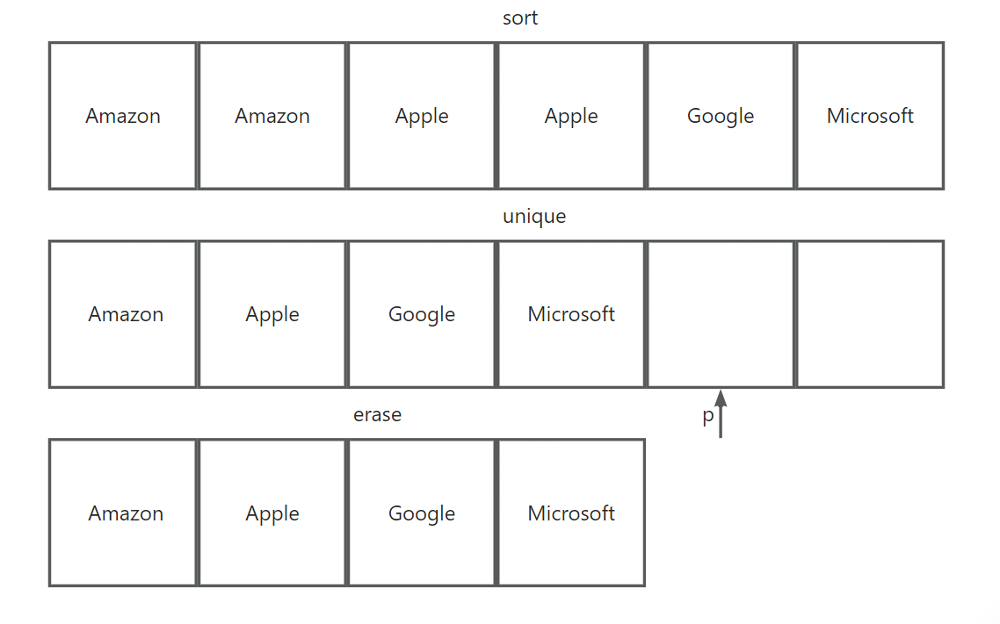

# C++

```cmake
cmake_minimum_required(VERSION 3.28)
project(leetcode)

set(CMAKE_CXX_STANDARD 17)
set(CMAKE_GENERATOR "Unix Makefiles")

add_executable(main main.cpp)

# mkdir build && cd build
# cmake ../
# make
# ./main
```

## 第1章 变量和基本类型

| 类型        | 含义                       | 大小         |
| ----------- | -------------------------- | ------------ |
| bool        | 布尔（UTF-8前缀u8）        | 未定义       |
| char        | 字符                       | 8位          |
| wchar_t     | 宽字符（前缀L）            | 16位         |
| char16_t    | Unicode16字符（前缀u）     | 16位         |
| char32_t    | Unicode32字符（前缀U）     | 32位         |
| short       | 短整型                     | 16位         |
| int         | 整型                       | 16位         |
| long        | 长整型（后缀l或L）         | 32位         |
| long long   | 长整型（后缀ll或LL）       | 64位         |
| float       | 单精度浮点数（后缀f或F）   | 6位有效数字  |
| double      | 双精度浮点数               | 10位有效数字 |
| long double | 扩展精度浮点数（后缀l或L） | 10位有效数字 |
| unsigned    | 后缀u或U                   |              |

### 1.1 初始化

-   数字类型赋给布尔类型：0为false，其他为true
-   浮点类型赋给整数类型：小数点后截断

```cpp
long double ld = 3.1415926;
int i1 = {ld}, i2{ld}; // 错误，不可转换
int i3= ld, i4(ld); // 正确，可转换（截断）
int &refi; // 错误，引用必须初始化

int i, j, *pi;
i = j = 0; // 正确
i = pi = 0; // 错误，不能将指针值赋给整型变量
```

### 1.2 引用、指针

-   type &ref
    &跟随类型名时，表示ref是一个引用
-   type *ptr
    *跟随类型名时，表示ptr是一个指针
-   ref = &i
    赋值表达式中，&是一个取地址符
-   ptr = *i
    赋值表达式中，\*是一个解引用符

void *类型的指针可指向任何非常量对象

```cpp
int &r1 = 6; // 错误，不可用字面值初始化普通引用
const int &r2 = 6; // 可用字面值初始化常量引用

int *p1 = nullptr, *p2 = 0, *p3 = NULL; // p1, p2, p3是空指针
double d = 3.14, *pd = &obj;
void *pv = &d; // void *类型的指针可指向任何非常量对象
```

指向指针的指针

```cpp
int i = 228;
int *pi = &i;
int **ppi = &pi; // 指向指针的指针
```

对指针的引用（实际上还是指针）

```cpp
int i = 228;
int *pi;
int *&r = pi; // 对指针的引用（实际上还是指针）
r = &i;
cout << *pi; // 228
```

### 1.3 const

```cpp
const int ci; // 错误，常量对象必须初始化
extern const int ci = 228; // a.cpp
extern const int ci; // b.cpp
```

-   常量引用可引用非常量
-   不可通过常量引用修改其引用的数据
-   普通引用不可引用常量

```cpp
int i = 228;
const int ci = i;
const int &cr1 = i;  // 正确
const int &cr2 = ci; // 正确
cr1 = 416;           // 错误
int &r = ci;         // 错误
```

-   指向常量的指针可指向非常量
-   不可通过指向常量的指针修改其指向的数据
-   指向非常量的指针不可指向常量

```cpp
double d = 3.14;
const double cd = d;
const double *cp1 = &d;  // 正确
const double *cp2 = &cd; // 正确
*cp1 = 3.1415926;        // 错误
double *p = &cd;         // 错误
```

### 1.4 constexpr

常量表达式：编译时即可得到值，且值不变
声明为constexpr类型的变量一定是常量，且必须使用常量表达式初始化

指向常量的指针：不可通过指向常量的指针修改其指向的数据
常量指针：不可修改指针值

```cpp
// 常量表达式
const int ci = 228;
const int cip = ci + 1;
constexpr int cei = 416;
constexpr int ceip = cei + 1;

const int *p = nullptr; // p是指向常量的指针
constexpr int *q = nullptr; // q是常量指针
```

### 1.5 类型别名

使用typedef或别名声明

```cpp
typedef int int_alias; // 使用typedef
using int_alias = int; // 别名声明

typedef char *pchar_alias;
const char *p; // p是指向常量的指针
const pchar_alias q; // q是常量指针
```

### 1.6 auto类型说明符

```cpp
int i = 0;
const int ci = i, &cr = ci;
auto a = ci; // a是整数
auto b = cr; // b是整数

auto c = &i; // c是整型指针
auto d = &ci; // d是指向常量的指针
auto *e = &ci; // e是指向常量的指针

auto &g = i; // e是整型引用
auto &h = ci; // h是常量引用
auto &i = 0; // 错误，普通引用不可引用字面值
const auto &j = 0; // 正确，常量引用可引用字面值
```

### 1.7 decltype类型指示符

``` cpp
const int ci = 0, &cr = ci;
decltype(ci) x = 0; // x是整型常量
decltype(cr) y = x; // y是常量引用，引用x
decltype(cr) z; // 错误，z是常量引用，必须初始化

int i = 0, &r = i, *p = &i;
decltype(r + 0) a; // a是整型
decltype(*p) b; // 错误，b是整型引用。必须初始化
decltype((i)) c; // 错误，c是整型引用，必须初始化
```

## 第2章 字符串、向量和数组

### 2.1 string

```cpp
string s; // s默认初始化为空串
string s1 = "aaa"; // 拷贝初始化
string s2("aaa"); // 直接初始化
string s3(3, 'a'); // 直接初始化
string s4 = string(3, 'a'); // 拷贝初始化
string s5 = s1； // 拷贝初始化
string s6(s1); // 拷贝初始化
```

| string s       | 操作                                                         |
| -------------- | ------------------------------------------------------------ |
| os << s        | 向输出流os中写入s（空白符分隔），返回os                      |
| is >> s        | 从输入流is中读取字符串赋给s（空白符分隔），返回is            |
| getline(is, s) | 从输入流is中读取一行赋给s（换行符分隔），返回is              |
| s.empty()      | s.isEmpty();                                                 |
| s.size()       | s.length;                                                    |
| s1 + s2        | s1.concat(s2)，字面值不可直接相加                            |
| s1 = s2        | s1是s2的副本                                                 |
| s1 == s2       | s1.equals(s2)                                                |
| <, <=, >, >=   | 根据字符进行字典排序，大小写敏感。"Hello" < "Hello World", "Hello" < "Hi" |

| #include <cctype> | char c                                         |
| ----------------- | ---------------------------------------------- |
| isalnum(c)        | Char c is a alphabet or num 是字母或数字       |
| isalpha(c)        | Char c is a alphabet 是字母                    |
| isdigit(c)        | Char c is a digital 是数字                     |
| islower(c)        | Char c is a lower alphabet 是小写字母          |
| isupper(c)        | Char c is a upper alphabet 是大写字母          |
| isxdigit(c)       | Char c is a hexadecimal digital 是十六进制数字 |
| tolower(c)        | Convert c to lower case if necessary           |
| toupper(c)        | Convert c to upper case if necessary           |

```cpp
string s = "ABCD EFG";
for (auto &c: s) c = tolower(c);
s[0] = 'A';
cout << s; // Abcd efg

s = "ABCD EFG";
for (decltype(s.size()) index = 0;
     index < s.size() && !isspace(s[index]);
     ++index)
    s[index] = tolower(s[index]);
cout << s; // abcd EFG
```

### 2.2 vector

初始化

```cpp
vector<int> v1;
v1 = {0, 1, 2};
vector<int> v2(v1); // 等价于vector<int> v2 = v1;
vector<int> v3(3); // v3 = {0, 0, 0};
vector<int> v4(3, 1); // v4 = {1, 1, 1};
vector<int> v5{0, 1, 2}; // 等价于vector<int> v5 = {0, 1, 2};
```

| vector<T\> v      | List<T\> list = new ArrayList<>()  |
| ----------------- | ---------------------------------- |
| v.empty()         | list.isEmpty()                     |
| v.size()          | list.size()                        |
| v.push_back(elem) | list.add(elem)                     |
| v[n]              | list.get(n)                        |
| v1 == v2          | 元素数量相同、对应位置的元素值相同 |
| <, <=, >, >=      | 字典排序                           |
| c.begin()         | 指向头元素的迭代器                 |
| c.end()           | 指向尾元素的后一个位置的迭代器     |

迭代器

| iter          | 指向元素的指针                                               |
| ------------- | ------------------------------------------------------------ |
| ++iter        | 指向后一个元素                                               |
| --iter        | 指向前一个元素                                               |
| iter + n      | 指向后n个元素，或指向尾元素的后一个位置                      |
| iter - n      | 指向前n个元素，或指向尾元素的后一个位置                      |
| iter1 - iter2 | 迭代器（指针）间的距离                                       |
| >, >=, <, <=  | 若某迭代器指向的位置在另一个迭代器指向的位置之前，则前者小于后者 |

```cpp
string s = "abcd efg";
if (s.begin() != s.end()) {
    auto iter = s.begin();
    *iter = toupper(*iter);
}
cout << s; // Abcd efg

string s = "ab cd";
for (auto iter = s.begin(); iter != s.end() && !isspace(*iter); ++iter) {
    *iter = toupper(*iter);
}
cout << s; // ABCD efg
```

迭代器类型

```cpp
string::iterator iter1; // iter1可读写string中的字符
vector<int>::iterator iter2; // iter2可读写vector<int>中的元素
string::const_iterator iter3; // iter3只读
vector<int>::const_ierator iter4; // iter4只读

vector<int> v;
const vector<int> cv;
auto iter5 = v.begin(); // iter5是vector<int>::iterator类型
auto iter6 = v.cbegin(); // iter6是vector<int>::const_iterator类型
auto iter7 = cv.begin(); // iter7是vector<int>::const_iterator类型
```

```cpp
vector<string> text{"Aa", "Bb", "", "Cc"};
for (auto iter = text.cbegin(); iter != text.cend() && !iter->empty(); ++iter) {
    cout << *iter; // AaBb
}
```

```cpp
vector<string> text{"Aa", "Bb", "Bb", "Cc", "Dd", "Ee", "Ff", "Gg"};
auto cbegin = text.cbegin(), cend = --text.cend();
// 指向中间元素的迭代器
auto cmid = text.cbegin() + (cend - cbegin) / 2;
auto target = "Bb";
while (cbegin != cend) {
    if (*cmid >= target) cend = cmid;
    else cbegin = cmid + 1; // *cmid < target
    cmid = cbegin + (cend - cbegin) / 2;
}
cout << cmid - text.cbegin(); // 1
```

### 2.3 数组

维度必须是常量表达式

```cpp
constexpr unsigned size = 3;
int a1[size] = {0, 1, 2};
int a2[] = {0, 1, 2};
int a3[6] = {0, 1, 2}; // 等价于int a3[] = {0, 1, 2, 0, 0, 0};
char a4[] = "C++"; // 等价于char a4[] = {'C', '+', '+', '\n'};

int b1[] = {0, 1, 2};
int b2[] = b1; // 错误，不可将一个数组赋给另一个数组
int *p[3]; // 指针数组（不存在引用数组）
int (*pa)[3]; // pa是指向大小为3的整型数组的指针
int (&ra1)[3]; // ra1是大小为3的整型数组的引用
int *(&ra2)[3]; // ra2是大小为3的指针数组的引用

int ia[] = {0, 1, 2};
int *p1 = &ia[0];
int *p2 = ia;
auto p3(ia);
// p1, p2, p3都是指向ia[0]的整型指针
p3 = 228; // 错误，不可将数字赋给指针
decltype(ia) nums = {3, 4, 5};
nums = p1; // 错误，不可将整型指针赋给整型数组名
```

指针也是迭代器

```cpp
int ia[] = {0, 1, 2};
int *p = ia; // p指向ia[0]
++p; // p指向ia[1]
int *end = &ia[3]; // end指向ia尾元素的后一个位置
// 等价于int *end = ia + sizeof(ia) / sizeof(int);
// 等价于int *end = ia + (std::end(ia) - std::begin(ia));
for (int *q = ia; q != end; ++q) cout << *q;
```

标准库函数begin、end

```cpp
int ia[] = {0, 1, 2};
int *pbegin = begin(ia);
int *pend = end(ia);
while (pbegin != pend) cout << *(pbegin++); // 012
```

| C风格字符串    | char s[4], s1[] = "s1", s2[] = "s2";                         |
| -------------- | ------------------------------------------------------------ |
| strlen(s)      | 返回s的长度                                                  |
| strcmp(s1, s2) | 比较s1、s2的大小：s1大于s2返回1，s1小于s2时返回-1，s1等于p2时返回0 |
| strcat(s1, s2) | 将s2拼接到s1后                                               |
| strcpy(s1, s2) | 将s2拷贝到s1                                                 |

```cpp
char s1[] = "Hello World ", s2[] = "Hola";
const int SIZE = (sizeof(s1) + sizeof(s2)) / sizeof(char);
char s[SIZE];
cout << strlen(s1) << endl; // 12
cout << strcmp(s1, s2) << endl; // -1
strcpy(s, s1);
cout << s << endl; // Hello World
strcat(s, s2);
cout << s << endl; // Hello World Hola

string s("Hello World");
char *p = s; // 错误，不可用string类型的对象初始化char *类型的指针
```

使用数组初始化vector对象

```cpp
int ia[] = {0, 1, 2, 3, 4, 5};
vector<int> v(begin(ia), end(ia));
vector<int> subv(ia + 1, ia + 4); // ia[1] ia[2] ia[3]
copy(v.cbegin(), v.cend(), std::ostream_iterator<int>(std::cout)); // 012345

copy(subv.cbegin(), subv.cend(), ostream_iterator<int>(cout, " ")); // 1 2 3
```

多维数组

```cpp
int ia1[2][2]; // 未初始化的脏数据
int ia2[2][2]{0}; // 初始化所有元素为0，等价于int ia2[2][2] = {0};
int ia3[2][2]{{0, 1}, {2, 3}}; // 0123
int ia4[2][2]{0, 1, 2, 3}; // 0123
int ia5[2][2]{{1}, {1}}; // 显式初始化每行第一个元素，隐式初始化其他元素为0
int ia6[2][2]{{0, 1}}; // 显式初始化第一行的所有元素，隐式初始化其他元素为0
int (&row)[2] = ia2[1]; // row是ia2[1]的引用
```

```cpp
int cnt = 0;
int ia[2][2];
for (auto &row : ia) { // for (auto prow : ia) prow是指向大小为3的整型数组的指针
    for (auto &col : row) { 
        col = cnt++;
    }
}
```

指针和多维数组

-   数组的数组名是常量指针，指向数组的头元素
-   若p是指向数组的头元素的指针，则*p是数组名
-   &数组名，得到指向数组的指针

```cpp
int ia[3][3]{0, 1, 2, 3, 4, 5, 6, 7, 8};
int (*p)[3]; // p是指向大小为3的整型数组的指针
int *pi[3];  // pi是一个大小为3的指针数组
p = &ia[2]; // p指向ia[2]
for (auto i = ia; i != ia + 3; ++i) { // i是指向大小为3的整型数组的指针
    for (auto j = *i; j != *i + 3; ++j) { // j是整型指针
        cout << *j; // 012345678
    }
}

for (auto i = begin(ia); i != end(ia); ++i) {
    for (auto j = begin(*i); j != end(*i); ++j) {
        cout << *j; // 012345678
    }
}

using array3_int = int[3]; // 类型别名，等价于typedef int array3_int[3];
for (array3_int *i = ia; i != ia + 3; ++i) {
    for (int *j = *i; j != *i + 3; ++j) {
        cout << *j; // 012345678
    }
}
```

## 第3章 表达式

位运算符

| ~        | 位求反 |
| -------- | ------ |
| <<       | 左移   |
| >>       | 右移   |
| &        | 位与   |
| ^        | 位异或 |
| \|       | 位或   |

sizeof运算符

-   sizeof(type)
-   sizeof expression

```cpp
class FD {
public:
    float fv;
    double dv;
};

FD fd, *p;
FD &r = fd;
int ia[]{0, 1, 2};
sizeof(FD); // 16（FD类型的对象占16个字节）
sizeof fd; // 16（对象fd占16个字节）
sizeof p; // 8（p占8个字节，即p是32位指针）
sizeof *p; // 16（p指向的对象占16个字节）
sizeof fd.fv; // 4（成员fv占4个字节）
sizeof FD::dv; // 8（成员dv占8个字节）
sizeof r; // 16（r引用的对象fd占16个字节）

sizeof ia; // 12（数组ia占12个字节）
sizeof(ia) / sizeof(*ia); // 3（数组ia的长度为3）

string s;
sizeof s; // sizeof(string) = 32
vector<int> v;
sizeof v; // sizeof(vector<int>) = 24
```

显式类型转换

-   static_cast<type\>(expression)
-   const_cast<type\>(expression)

强制类型转换（旧）

-   (type) (expression)

```cpp
// static_cast 显式类型转换
int i1 = 1, i2 = 2;
double d = static_cast<double>(i1) / i2;
void *pi = &d; // void *类型的指针可指向任何非常量对象
double *pd = static_cast<double *>(pi);

// const_cast 在常量对象与非常量对象之间转换
char c = 'c';
char *pc1 = &c;
const char *pc2 = &c;
const char *pc3 = const_cast<const char *>(pc1);
char *pc4 = const_cast<char *>(pc2);

// reinterpret_cast 强制类型转换
```

异常

```cpp
try {
    throw (exception("FBI WARNING"));
} catch (exception &e) {
    cout << e.what();
}
```

## 第4章 函数

局部静态对象

```cpp
// using size_t = long long int
size_t counter( /* void */ ) {
    static size_t count; // 默认初始化为0
    return ++count; 
}

int main() {
    for (size_t i = 0; i != 5; ++i) cout << counter();
    return 0; // 12345
}
```

### 4.1 参数传递

-   值传递：拷贝值
-   引用传递：形参是实参的别名
-   指针传递：拷贝指针值（32位指针值）

const默认左侧为const，左侧为空则右侧为const

-   const int *p 指向常量的指针
-   int *const p 常量指针

### 4.2 数组形参

``` cpp
void print1(const int *a) { cout << a[0] << a[1]; }

void print2(const int a[]) { cout << *a << *(a + 1); }

void print3(const int *p, const int *end) {
    while (p != end) cout << *(p++);
}

void print4(const int (&a)[2], const int size) {
    for (int i = 0; i != size; ++i) cout << a[i];
}

int a[]{0, 1};
print1(a);
print2(a);
print3(begin(a), end(a));
print4(a, 2);
```

### 4.3 多维数组形参

```cpp
// matrix是指向数组的指针
// 若p是指向数组的指针，则*p可看作数组名
void print1(int (*matrix)[2], int row_size) {
    for (int i = 0; i < row_size; ++i) {
        copy(begin(*(matrix + i)),
             end(*(matrix + i)),
             ostream_iterator<int>(cout));
    }
}
void print2(int matrix[][2], int row_size) {
    for (int i = 0; i < row_size; ++i) {
        copy(begin(matrix[i]),
             end(matrix[i]),
             ostream_iterator<int>(cout));
    }
}

int a[][2]{0, 1, 2, 3};
print1(a, 2); // 0123
print2(a, 2); // 0123
```

### 4.4 可变形参

initializer_list<T\>类型的形参（T类型的实参数量未知）

```cpp
initializer_list<int> l1; // 整型元素的空列表
initializer_list<int> l2{0, 1, 2};
l1 = l2; // 不会拷贝列表中的元素
l1.size(); // 3
auto begin = l1.begin(); // 返回指向l1头元素的指针
auto end = l1.end(); // 返回指向l1尾元素的指针
for (auto p = begin; p != end; ++p) cout << *p; // 01

void print(initializer_list<string> l) {
    for (const auto &p: l) cout << p;
}
print({"I", "Love", "U"});
```

```cpp
void sample1(int *i) {}
void sample2(int &i) {}

int i = 0;
const int ci = i;
sample1(&i); // 正确
sample1(&ci); // 错误，不可用指向常量的指针初始化指向非常量的指针
sample2(i); // 正确
sample2(ci); // 错误，非常量引用不可引用常量
sample2(666); // 错误，非常量引用不可引用字面值
```

### 4.5 不可返回局部对象的引用或指针

```cpp
const string &empty() {
    string ret;
    cin >> ret;
    return ret.empty() ? "empty" : ret; // 错误
}

const string *empty() {
    auto ret = new string();
    cin >> *ret;
    if (ret->empty()) *ret = "empty";
    return ret;
}
```

### 4.6 返回列表

```cpp
vector<string> ret_v1() {
    return {"a", "b", "c"};
}
vector<string> ret_v2() {
    return *(new vector<string>{"A", "B", "C"});
}

auto v1 = ret_v1();
copy(v1.begin(), v1.end(), ostream_iterator<string>(cout)); // abc
auto v2 = ret_v2();
copy(v2.begin(),v2.end(), ostream_iterator<string>(cout)); // ABC
```

### 4.7 返回数组指针

```cpp
int odd[]{1, 3, 5};
int even[] = {2, 4, 6};

// 函数声明
int (*choose1(int))[3]; // 若p是指向数组的指针，则*p是数组名

// 使用类型别名
typedef int array3_int[3]; // 等价于using array3_int = int[3];
array3_int *choose1(int i) {
    return i % 2 == 0 ? &odd : &even;
}

// 使用尾置返回类型（推荐）
auto choose2(int i) -> decltype(odd) * {
    return i % 2 == 0 ? &odd : &even;
}

void print(int (*parr)[3]) {
    for (int *pi = *parr, i = 0; i < 3; ++i) {
        cout << *(pi++);
    }
}

int main() {
    int (*parr1)[3] = choose1(0);
    int (*parr2)[3] = choose2(1);
    print(parr1); // 135
    print(parr2); // 246
    return 0;
}
```

```cpp
typedef int array3_int[3]; // 等价于using array3_int = int[3];

array3_int *setting1(int i, int (&arr)[3]) {
    arr[0] = arr[1] = arr[2] = i;
    cout << typeid(&arr).name(); // Pointer_Array3_Integer
    return &arr;
}

auto setting2(int i, int (*arr)[3]) -> int (*)[3] {
    (*arr)[0] = (*arr)[1] = (*arr)[2] = i;
    cout << typeid(&arr).name(); // Pointer_Array3_Integer
    return arr;
}


int main() {
    int arr[3];
    int (*p_array3_int)[3] = setting1(6, arr);
    for (auto &i: *p_array3_int)cout << i; // 666
    setting2(7, &arr);
    for (auto &i: *p_array3_int) cout << i; // 777
    return 0;
}
```

### 4.8 默认实参、内联函数、constexpr函数

默认实参：右侧

内联函数：inline，减小函数调用的开销

constexpr函数：隐式inline，函数体中只有一条return语句

### 4.9 指向函数的指针

函数名 = 指向函数的指针值 = 函数的地址

```cpp
int sub_size(string &s1, string &s2) {
    return static_cast<int>(s1.size() - s2.size());
}

int (*psub_size)(string &, string &) = sub_size;

void print(string &s1, string &s2, int sub_size(string &, string &)) {
    cout << sub_size(s1, s2);
}

using func = int(int, int *);
using pfunc = int (*)(int, int *);

constexpr int add(int i, int *pi) { return i + *pi; }

// 可返回函数指针，不可返回函数引用
func *add1() { return add; }

pfunc add2() {
    return [](int i, int *pi) -> int { return i + *pi; };
}


int main() {
    string p = "posts", c = "communications";
    print(p, c, sub_size); // -9
    print(p, c, psub_size); // -9
    int i = 1;
    cout << add1()(1, &i); // 2
    cout << add2()(1, &i); // 2
    return 0;
}
```

## 第5章 类

```cpp
// struct默认访问权限：public
// class默认访问权限：private
struct Student {
    int id;
    string name;

    // const表示this是一个指向常量的常量指针
    // 使用const的成员函数称为常量成员函数
    int getId() const { return id; }

    // 函数体在内部：内联
    // 函数体在外部：非内联
    string getName() const;

    // 类未声明构造函数时，由编译器生成默认构造函数
    Student() = default; // Student() {}
    Student(int id, string &name) : id(id), name(name) {} // 构造函数初始值列表
};

string Student::getName() const { return name; } // return this->name;
```

```cpp
class Student {
    string name; // private
    friend void print(Student &); // 友元：允许其他类或函数访问私有、受保护成员

public:
    Student() = default;
    Student(const string &name);
};

Student::Student(const string &name) { this->name = name; }

void print(Student &stu) { cout << stu.name; }

int main() {
    class Student stu1;
    class Student stu2;
    class Student stu3 = Student("yukino");
    class Student stu4("yukino");
    Student stu5("yukino");
    print(stu1);
    print(stu3); // yukino
    return 0;
}
```

```cpp
class Screen; // Screen类的声明

class Window {
    Screen *s;
public:
    Window(Screen *s) : s(s) {}
    void clear() const;
};

class Screen {
    using varchar = char;
    friend class Window; // 指定类为友元
    friend void Window::clear() const; // 指定类的成员函数为友元
public:
    Screen() = default; // 隐式内联
    Screen(int w, int h, varchar c) : width(w), height(h), contents(w * h, c) {} // 隐式内联
    Screen &move(int row, int column); // 返回*this的成员函数
    Screen &set_char(varchar); // 返回*this的成员函数
    void to_string() { cout << contents << endl; }
private:
    int width = 0, height = 0, cursor = 0;
    mutable string contents;
};

// 显式内联
inline Screen &Screen::move(int row, int column) { cursor = row * width + column; return *this; }
inline Screen &Screen::set_char(Screen::varchar c) { contents[cursor] = c; return *this; }
void Window::clear() const { s->contents = string(s->height * s->width, '*'); }

int main() {
    Screen screen(3, 3, 'O');
    screen.to_string(); // OOOOOOOOO
    screen.move(1, 1).set_char('#');
    screen.to_string(); // OOOO#OOOO
    Window window(&screen);
    window.clear();
    screen.to_string(); // *
}
```

```cpp
int v = 1;
class Sample {
    int v = 2;

   public:
    void print(int v) {
        cout << ::v; // 1
        cout << this->v; // 2
        cout << Sample::v; // 2
        cout << v; // 3
    }
};

int main() {
    Sample().print(3);
    return 0;
}
```

```cpp
class Sample {
private:
    friend void print(Sample);

    int i;
    string s;

public:
    Sample(int i, string s) : i(i), s(std::move(s)) {}

    // 委托构造函数
    Sample(int i) : Sample(i, "") {}
    // 将只有一个参数的构造函数声明为explicit，以阻止隐式类型转换
    explicit Sample(string s) : Sample(0, std::move(s)) {}
};

void print(Sample sample) { cout << sample.i << sample.s; }

print(666); // 隐式类型转换
string s = "666";
print(s); // 错误
print(static_cast<Sample>(s)); // 显式类型转换
```

聚合类

```cpp
struct Data {
    int v;
    string s;
};

// 列表初始化
Data data1 = {0, "yukino"};
Data data2{1, "shita"};
```

```cpp
class Screen {
    static Screen s1; // 正确，静态成员可以是不完全类型
    Screen *ps; // 正确，指针成员可以是不完全类型
    Screen s2; // 错误，非静态数据成员必须是完全类型
    static const char C; 
public:
    Screen &clear(char = C); // 静态数据成员可以作为默认实参，非静态数据成员不可以作为默认实参
};
```

-   istream/ostream 输入流/输出流
-   cin/cout 输入流对象/输出流对象

## 第6章 STL

### 6.1 顺序容器

| 顺序容器类型 |                                                        |
| ------------ | ------------------------------------------------------ |
| vector       | 可变大小数组，支持随机访问，只方便在尾部插入和删除     |
| deque        | 双端队列，支持随机访问，只方便在头部、尾部插入和删除   |
| list         | 双向链表，只支持双向顺序访问，方便插入和删除           |
| forward_list | 单向链表，只支持单向顺序访问，方便插入和删除           |
| array        | 固定大小数组，支持随机访问，不可插入或删除元素         |
| string       | 类似vector的容器，用于保存字符，只方便在尾部插入和删除 |

| 顺序容器操作                                  |                                                              |
| --------------------------------------------- | ------------------------------------------------------------ |
| iterator, const_iterator                      | 容器的（只读）迭代器                                         |
| size_type                                     | 无符号整型（元素数量的最大值）                               |
| difference_type                               | 有符号整型（迭代器间的距离的最大值）                         |
| value_type                                    | 元素类型                                                     |
| reference, const reference                    | 等价于value_type &, const value_type &                       |
| C c;                                          | 调用默认构造函数，构造空容器                                 |
| C c(n[, elem]);                               | C c{elem, elem, ...} n个元素                                 |
| C c1(c2); C c1 = c2;                          | 构造c1的深拷贝c2                                             |
| C c{a, b, c}; C c = {a, b, c};                | c1初始化为{a, b, c}                                          |
| c1.swap(c2); swap(c1, c2);                    | 交换引用c1、c2                                               |
| c.size()                                      | 元素数量                                                     |
| c.max_size()                                  | 元素数量的最大值                                             |
| c.empty()                                     | c是否为空                                                    |
| c.insert(elem)                                | 插入一个元素                                                 |
| c.emplace(args)                               | 构造一个元素，再插入                                         |
| c.begin(); c.end(); c.cbegin(); c.cend();     | 返回迭代器                                                   |
| reverse_iterator; const_reverse_iterator      | 逆序（只读）迭代器                                           |
| c.rbegin(); c.rend(); c.crbegin(); c.crend(); | 返回逆序（只读）迭代器                                       |
| c.assign(b, e)                                | 将c中的元素替换为范围[b, e)中的元素                          |
| c.assign({elem_list})                         | 将c中的元素替换为elem_list中的元素                           |
| c.assign(n, elem)                             | 将c中的元素替换为n个elem元素                                 |
| c.push_back(elem)                             | 尾插一个元素                                                 |
| c.emplace_back(args)                          | 构造一个元素，再尾插                                         |
| c.push_front(elem)                            | 头插一个元素                                                 |
| c.emplace_front(args)                         | 构造一个元素，再头插                                         |
| c.insert(iter, elem)                          | 在iter前插入一个元素，返回指向被插入元素的迭代器             |
| c.insert(iter, args)                          | 构造一个元素，再在iter前插入，返回指向被插入元素的迭代器     |
| c.insert(iter, n, elem)                       | 在iter前插入n个elem元素，返回指向第一个被插入元素的迭代器    |
| c.insert({iter, b, e})                        | 在iter前插入范围[b, e)中的元素，返回指向第一个被插入元素的迭代器 |
| c.insert(iter, {elem_list})                   | 在iter前插入{elem_list}中的元素，返回指向第一个被插入元素的迭代器 |
| c.front()                                     | 返回对c的头元素的引用                                        |
| c.back()                                      | 返回对c的尾元素的引用                                        |
| c[k]                                          | 返回对c中下标为k的元素的引用                                 |
| c.at(k)                                       | 返回对c中下标为k的元素的引用，若k不在c中，则抛出out_of_range异常 |
| c.pop_back()                                  | 删除c的尾元素                                                |
| c.pop_front()                                 | 删除c的头元素                                                |
| c.erase(iter)                                 | 删除iter指向的元素，返回指向被删除元素的后一个位置的迭代器   |
| c.erase(b, e)                                 | 删除范围[b, e)中的元素，返回指向最后一个被删除元素的后一个位置的迭代器 |
| c.clear()                                     | 清空c                                                        |
| c.resize(n)                                   | 调整c的大小为n个元素                                         |
| c.resize(n, elem)                             | 调整c的大小为n个元素，新元素初始化为elem                     |

```cpp
vector<int> c0 = {0, 0, 0};
vector<int> c1{c0}; // 深拷贝
vector<int> c2 = c0; // 深拷贝
c0[0] = c1[1] = c2[2] = 1;
copy(c0.cbegin(), c0.cend(), ostream_iterator<int>(cout)); // 100
copy(c1.cbegin(), c1.cend(), ostream_iterator<int>(cout)); // 010
copy(c2.cbegin(), c2.cend(), ostream_iterator<int>(cout)); // 001
vector<int> c3 = {1, 1, 1};
vector<int> c4 = {1, 1};
vector<int> c5 = {1};
c4 = c3; // 深拷贝
c5 = c3; // 深拷贝
c3[0] = c4[1] = c5[2] = 0;
copy(c3.cbegin(), c3.cend(), ostream_iterator<int>(cout)); // 011
copy(c4.cbegin(), c4.cend(), ostream_iterator<int>(cout)); // 101
copy(c5.cbegin(), c5.cend(), ostream_iterator<int>(cout)); // 110
vector<int> &c6{c0}; // 浅拷贝
vector<int> &c7 = c0; // 浅拷贝
c6[1] = c7[2] = 1;
copy(c0.cbegin(), c0.cend(), ostream_iterator<int>(cout)); // 111
copy(c6.cbegin(), c6.cend(), ostream_iterator<int>(cout)); // 111
copy(c7.cbegin(), c7.cend(), ostream_iterator<int>(cout)); // 111
// cmake ../ -G "Unix Makefiles"
```

```cpp
vector<const char *> v = {"const", "char *", "equalsTo", "string"};
forward_list<string> l(v.cbegin(), v.cend());
copy(l.cbegin(), l.cend(), ostream_iterator<string>(cout));
array<int, 3> arr0; // 脏数据
array<int, 3> arr1{}; // 000
array<int, 3> arr2{1}; // 111
array<int, 3> arr3{0, 1, 2}; // 012
array<int, 5> arr4{0, 1, 2}; // 01200
array<int, 5> arr5{arr4}; // 深拷贝
array<int, 5> arr6 = arr4; // 深拷贝
// int src[5] = {0, 1, 2}; int dest[5] = src; // 错误
arr5[3] = 3;
arr6[4] = 4;
copy(arr4.cbegin(), arr4.cend(), ostream_iterator<int>(cout)); // 01200
```

| 在forward_list中插入或删除元素       |                                                              |
| ------------------------------------ | ------------------------------------------------------------ |
| l.before_begin(); l.cbefore_begin(); | 返回指向链表第一个元素的前一个位置的（只读）迭代器           |
| l.insert_after(iter, elem)           | 在iter后插入一个元素，返回指向被插入元素的迭代器             |
| l.insert_after(iter, n, elem)        | 在iter后插入n个elem元素，返回指向最后一个被插入元素的迭代器  |
| l.insert_after(iter, b, e)           | 在iter后插入范围[b + 1, e)中的元素，返回指向最后一个被插入元素的迭代器 |
| l.insert_after(iter, {elem_list})    | 在iter后插入{elem_list}中的元素，返回指向最后一个被插入元素的迭代器 |
| emplace_after(iter, args)            | 构造一个元素，再在iter后插入，返回指向被插入元素的迭代器     |
| l.erase_after(iter)                  | 删除iter指向的元素的后继元素，返回指向被删除元素的后一个位置的迭代器 |
| l.erase_after(b, e)                  | 删除范围[b + 1, e)中的元素，返回指向最后一个被删除元素的后一个位置的迭代器 |

| 大小size与容量capacity |                         |
| ---------------------- | ----------------------- |
| c.capacity()           | c的容量                 |
| c.reverse(n)           | c.capacity() ≥ n        |
| c.shrink_to_fit()      | c.capacity() = c.size() |

| 特殊的string操作             |                                                             |
| ---------------------------- | ----------------------------------------------------------- |
| string s(const char *p, n)   | s是*p前n个字符的拷贝                                        |
| string s(char arr[], n)      | s是arr前n个字符的拷贝                                       |
| string s1(string s2, pos)    | s1是s2从pos开始的所有字符的拷贝                             |
| string s1(string s2, pos, n) | s1是s2从pos开始的n个字符的拷贝                              |
| s.substr([pos, ]n)           | 返回s从pos（默认为0）开始的n个字符（默认所有字符）的拷贝    |
| s.insert(pos, args)          | 在pos前插入字符，返回对s的引用                              |
| s.insert(iter, args)         | 在iter前插入字符，返回指向第一个被插入字符的迭代器          |
| s.erase(pos, n)              | 删除从pos开始的n个字符（默认所有字符）                      |
| s.assign(args)               | 将s中的字符替换为args指定的字符                             |
| s.append(args)               | 将args指定的字符追加到s，返回对s的引用                      |
| s.replace(pos, n, args)      | 删除从pos开始的n个字符，替换为args指定的字符，返回对s的引用 |
| s.replace(b, e, args)        | 删除范围[b, e)中的字符，替换为args指定的字符，返回对s的引用 |

```cpp
const char *p = "Hello World!!!";
char arr[]{'H', 'e', 'l', 'l', 'o', '\0'};
string s1(p); // Hello World!!!
string s2(arr, 2); // He
string s3(arr); // Hello
string s4(p + 6, 5); // World
string s5(s1, 6, 5); // World
string s6(s1, 6); // World!!!
string s7(s1, 6, 666); // World!!!
try { string s8(s1, 666); } catch (out_of_range &e) { cout << e.what(); }
```

```cpp
string s1("Hello World");
string s2 = s1.substr(0, 5); // Hello
string s3 = s1.substr(6); // World
string s4 = s1.substr(6, 666); // World
try { string s5 = s1.substr(666); } catch (out_of_range &e) { cout << e.what(); }
```

```cpp
string s1("Hello");
s1.insert(s1.size(), 3, '!'); // pos=s1.size(), n=3, c='!'
// s1 == "Hello!!!"
s1.erase(s1.size() - 3, 3); // pos=s1.size(), n=3
// s1 == "Hello"
const char *p = "C++ Java";
s1.assign(p, 3); // s=p, n=3
// s1 = "C++"
s1.insert(s1.size(), p + 3); // pos=s1.size(), s=p+3
// s1 = "C++ Java"
string s2 = "Java C++";
s1.insert(0, s2);
// s1 = "Java C++C++ Java"
s1.insert(8, s2, 5, s1.size() - 5);// pos1=8, str=s2, pos2=5, n=3
// s1 = "Java C++C++C++ Java"
```

```cpp
string s1("C++ Primer"), s2 = s1;
s1.insert(s1.size(), "4th Ed"); // C++ Primer4th Ed
s2.append("4th Ed"); // C++ Primer4th Ed
s1.erase(10, 3); // C++ Primer  Ed
s1.insert(10, "5th"); // C++ Primer5th Ed
s2.replace(10, 3, "5th"); // pos=10, n1=3, s="5th"
// s2 == "C++ Primer5th Ed"
```

| string的搜索操作           |                                               |
| -------------------------- | --------------------------------------------- |
| s1.find(args)              | 搜索s中字符（串）第一次出现的位置             |
| s1.rfind(args)             | 逆向搜索s中字符（串）第一次出现的位置         |
| s1.find_first_of(args)     | 搜索s中，字符串中的字符第一次出现的位置       |
| s1.find_last_of(args)      | 搜索s中，字符串中的字符最后一次出现的位置     |
| s1.find_first_not_of(args) | 搜索s中，不在字符串中的字符第一次出现的位置   |
| s1.find_last_not_of(args)  | 搜索s中，不在字符串中的字符最后一次出现的位置 |
| args                       | 搜索失败，返回string::npos                    |
| (c, pos)                   | 从pos开始搜索c，pos默认为0                    |
| (s2, pos)                  | 从pos开始搜索s2，pos默认为0                   |
| (p, pos)                   | 从pos开始搜索*p，pos默认为0                   |
| (p, pos, n)                | 从pos开始搜索*p的前n个字符                    |

```cpp
string genUUID() {
    random_device rd;
    mt19937_64 gen(rd());
    uniform_int_distribution<uint64_t> distribution;
    uint64_t pre = distribution(gen);
    uint64_t post = distribution(gen);
    ostringstream oss;
    oss << hex << pre << post;
    string uuid = oss.str();
    return uuid.substr(0, 32);
}

int main() {
    string name("StarRail");
    auto pos = name.find('a'); // 搜索'a'
    auto rpos = name.rfind('a'); // 逆向搜索'a'
    const char *p = "01234";
    const char arr[]{'5', '6', '7', '8', '9', '\0'};
    string uuid = genUUID();
    cout << uuid << endl;
    cout << uuid.find_first_of(p); // 搜索uuid中第一个[0, 4]
    cout << uuid.find_last_of(arr); // 搜索uuid中最后一个[5, 9]
}
```

| compare函数                          |                                                              |
| ------------------------------------ | ------------------------------------------------------------ |
| s1.compare(s2)                       | 比较s1、s2                                                   |
| s1.compare(pos1, n1, s2[, pos2, n2]) | 将s1从pos1开始的n1个字符与s2（从pos2开始的n2个字符）进行比较 |
| s1.compare(p)                        | 比较s1、*q                                                   |
| s1.compare(pos1, n1, p)              | 将s1从pos1开始的n1个字符与*p进行比较                         |
| s1.compare(pos1, n1, p, n2)          | 将s1从pos1开始的n1个字符与*p的n2个字符进行比较               |

| string和数值间的转换                                         |                                                              |
| ------------------------------------------------------------ | ------------------------------------------------------------ |
| to_string(v)                                                 | 返回数值v对应的字符串                                        |
| stoi(s, p, b); stol(s, p, b); stoul(s, p, b); stoll(s, p, b); | 返回s的起始子串对应的整数数值；p是size_t型指针，指向第一个非数值字符，默认为空指针；b是基数，默认为10 |
| stof(s, p); stod(s, p); stold(s, p);                         | 返回s的起始子串对应的浮点数数值                              |

顺序容器适配器（adaptor）：stack, queue, priority_queue

```cpp
deque<int> adeque{1, 2, 3};
stack<int> astack(adeque);
while (!astack.empty()) {
    cout << astack.top(); // 321
    astack.pop();
}
```

| 栈默认基于deque，也可基于list或vector |                            |
| ------------------------------------- | -------------------------- |
| s.pop()                               | 删除栈顶元素               |
| s.push(elem)                          | 将新元素压入栈顶           |
| s.emplace(args)                       | 构造一个新元素，并压入栈顶 |
| s.top()                               | 读栈顶元素                 |

| queue默认基于deque，也可基于list或vector | priority_queue默认基于vector，也可基于deque   |
| ---------------------------------------- | --------------------------------------------- |
| q.pop()                                  | 删除queue队头元素；删除priority_queue堆顶元素 |
| q.push(elem)                             | 新元素入队                                    |
| q.emplace(args)                          | 构造一个新元素，并入队                        |
| q.front(); q.back();                     | 返回queue队头/队尾元素                        |
| q.top                                    | 返回priority_queue堆顶元素                    |

### 6.2 泛型算法

#### 6.2.1 只读函数find

```cpp
string *p = find(begin(arr), end(arr), "target");
string *p = find(str.cbegin(), str.cend(), "target");
string *p = find(vec.cbegin(), vec.cend(), "target");
```

#### 6.2.2 只读函数accumulate

```cpp
int sum = accumulate(vec.cbegin(), vec.cend(), 0); // sum的初始值为0
// 传递""则编译错误，const char *类型未重载加法运算符
string sum = accumulate(vec.cbegin(), vec.cend(), string(""));
```

#### 6.2.3 只读函数equal：判断两个子序列的元素是否相同

```cpp
bool ret = equal(vec1.cbegin(), vec1.cend(), vec2.cbegin());
```

#### 6.2.4 写函数fill

```cpp
fill(vec.begin(), vec.end(), 0); // 将所有元素置0
fill_n(vec.begin(), vec.size(), 0); // 将所有元素置0
```

#### 6.2.5 写函数back_inserter

```cpp
vector<int> vec; // 空向量
auto iter = back_inserter(vec); // 对iter赋值，可将元素尾插到vec中
*iter = 1; *iter = 2; *iter = 3;
copy(vec.cbegin(), vec.cend(), ostream_iterator<int>(cout)); // 123
```

#### 6.2.6 拷贝函数copy

```cpp
int arr1[]{1, 2, 3, 4, 5};
int arr2[sizeof(arr1) / sizeof(*arr1)];
int *ret = copy(begin(arr1), end(arr1), arr2);
cout << (ret == end(arr2)); // true
```

#### 6.2.7 替换函数replace, replace_copy

```cpp
replace(vec.begin(), vec.end(), 0, 1); // 将vec中所有的0替换为1
// vec2是vec1的深拷贝，并将vec1中所有的0替换为1；通过back_inserter，按需分配vec2
replace_copy(vec1.cbegin(), vec1.cend(), back_inserter(vec2), 0, 1);
```

#### 6.2.8 排序函数sort、去重函数unique



```cpp
bool comp(const string &s1, const string &s2) { return s1.size() > s2.size(); }

int main() {
    vector<string> vec{"Apple", "Amazon", "Google", "Microsoft", "Apple", "Amazon"};
    sort(vec.begin(), vec.end()); // 字典排序
    auto p = unique(vec.begin(), vec.end()); // 去重，p指向最后一个不重复元素的后一个位置
    vec.erase(p, vec.cend());
    copy(vec.cbegin(), vec.cend(), ostream_iterator<string>(cout, " ")); // Amazon Apple Google Microsoft
    sort(vec.begin(), vec.end(), comp);
    copy(vec.cbegin(), vec.cend(), ostream_iterator<string>(cout, " ")); // Microsoft Amazon Google Apple
    return 0;
}
```

#### 6.2.9 遍历函数for_each

```cpp
for_each(vec.cbegin(), vec.cend(), [](const string &s) -> void { cout << s << " "; });
```

### 6.3 lambda表达式

[capture list] (parameters list) -> (return type) { function body }，参数列表和返回类型可省略

```cpp
sort(vec.begin(), vec.end(), [](const string &s1, const string &s2) { return s1.size() > s2.size(); });
```

捕获列表capture list

```cpp
vector<string> vec{"Apple", "Amazon", "Google", "Microsoft"};
int size = 6;
auto p = find_if(vec.begin(), vec.end(), [size](const string &s) { return s.size() > size; });
cout << p - vec.begin(); // 3
```

定义lambda时，编译器构造一个lambda对应类型的对象

#### 6.3.1 值捕获与引用捕获

```cpp
int val_cap() { // 值捕获
    int v = 666;
    auto f = [v] { return v; };
    v = 0;
    return f(); // 666
}

int ref_cap1() { // 引用捕获
    int v = 666;
    auto f = [&v] { return v; };
    v = 0;
    return f(); // 0
}

void ref_cap2(vector<string> vec, ostream &os = cout, char c = ' ') { // 引用捕获
    for_each(vec.cbegin(), vec.cend(), [&os, c](const string &s) { os << s << c; });
} // clion datagrip goland idea webstorm pycharm

int main() {
    cout << val_cap() << endl;
    cout << ref_cap1() << endl;
    vector<string> vec{"clion", "datagrip", "goland", "idea", "webstorm", "pycharm"};
    ref_cap2(vec);
    return 0;
}
```

#### 6.3.2 隐式捕获

=值捕获方式，&引用捕获方式，捕获列表的第一个元素必须是=或&

```cpp
void ref_cap1(vector<string> vec, ostream &os = cout, char c = ' ') {
    // os隐式捕获，引用捕获方式；c显式捕获，值捕获方式
    for_each(vec.cbegin(), vec.cend(), [&, c](const string &s) { os << s << c; });
}

void ref_cap2(vector<string> vec, ostream &os = cout, char c = ' ') {
    // c隐式捕获，值捕获方式；os显式捕获，引用捕获方式
    for_each(vec.cbegin(), vec.cend(), [=, &os](const string &s) { os << s << c; });
}
```

可变lambda：可改变被捕获的变量的值，可省略参数列表

```cpp
int main() {
    int v1 = 0, v2 = 0;
    [v1, &v2]() mutable {
        ++v1;
        ++v2;
    }();
    cout << v1 << v2; // 01
}
```

指定lambda返回类型

```shell
vector<int> vec{1, -2, 3, -4, 5};
transform(vec.begin(), vec.end(), vec.begin(), [](int i) -> int { return abs(i); });
for_each(vec.cbegin(), vec.cend(), [](int i) -> void { cout << i; }); // 12345
```

#### 6.3.3 标准库bind函数、ref/cref函数

标准库bind函数

auto newCallable = bind(callable, args)

```cpp
#include <iostream>
#include <vector>
#include <functional>
#include <algorithm>
using namespace std;
bool comp_size(const string &s, string::size_type size) { return s.size() > size; };
int main() {
    vector<string> vec{"Apple", "Amazon", "Google", "Microsoft"};
    // placeholders::_n占位符，n表示newCallable的第n个参数
    auto comp6 = bind(comp_size, placeholders::_1, 6); // compare(placeholders::_1, 6);
    auto p = find_if(vec.cbegin(), vec.cend(), comp6);
    cout << *p; // Microsoft
    return 0;
}
```

标准库ref函数

```cpp
ostream &print(ostream &os, const string &s, char c) {
    return os << s << c;
}
int main() {
    vector<string> vec{"Apple", "Amazon", "Google", "Microsoft"};
    ostream &os = cout;
    // ostream类型没有构造函数，传递一个不能拷贝的对象时，使用标准库ref/cref函数
    for_each(vec.cbegin(), vec.cend(), bind(print, ref(os), placeholders::_1, ' '));
    return 0;
}
```

### 6.4 迭代器

-   插入迭代器（insert iterator）
-   流迭代器（stream iterator）
-   反向迭代器（reverse iterator）除forward_list外的容器都支持反向迭代器
-   剪切迭代器（move iterator）

#### 6.4.1 插入迭代器

*iter = v; c是iter绑定的容器

-   back_inserter创建一个调用push_back的迭代器，调用c.push_back(v)
-   front_inserter创建一个调用push_front的迭代器，调用c.push_front(v)
-   inserter创建一个调用insert的迭代器，调用c.insert(v, p)，在iter前插入一个元素

*iter = v等价于iter = c.insert(iter, v); ++iter

```cpp
list<int> l1{1, 2, 3, 4, 5};
list<int> l2, l3; // 空list
copy(l1.cbegin(), l1.cend(), front_inserter(l2));
for_each(l2.cbegin(), l2.cend(), [](const int i) { cout << i; }); // 54321
copy(l1.cbegin(), l1.cend(), inserter(l3, l3.begin()));
for_each(l3.cbegin(), l3.cend(), [](const int i) { cout << i; }); // 12345
```

#### 6.4.2 iostream迭代器

```cpp
int main() {
    vector<int> vec;
    istream_iterator<int> in_iter(cin);
    istream_iterator<int> eof; // ctrl + d
    // 当迭代器绑定的流读取文件尾时，或IO错误时，该迭代器与尾后迭代器相等
    while (in_iter != eof) { vec.push_back(*(in_iter++)); }
    for_each(vec.cbegin(), vec.cend(), [](const int i) { cout << i; });
    return 0;
}
```

| istream_iterator操作             |                                                              |
| -------------------------------- | ------------------------------------------------------------ |
| istream_iterator<T\> in_iter(is) | in_iter从输入流is中读取T类型的值                             |
| istream_iterator<T\> end         | 尾后迭代器                                                   |
| in_iter1 == in_iter2             | 若读取类型相同、都是尾后迭代器，或绑定的输入流相同，则两个迭代器相等 |
| *in_iter                         | 从输入流中读取的值                                           |
| ++in, in++                       | 从输入流中读取后一个值                                       |

```cpp
istream_iterator<int> in(cin), eof;
cout << accumulate(in, eof, 0); // 计算从标准输入流读取的值的和
```

| ostream_iterator操作                 |                                                        |
| ------------------------------------ | ------------------------------------------------------ |
| ostream_iterator<T\> out_iter(os)    | out_iter将T类型的值写入输出流os                        |
| ostream_iterator<T\> out_iter(os, c) | out_iter将T类型的值写入输出流os，每一个值后都输出一个c |
| *out_iter = v                        | 将值写入out_iter绑定的输出流中                         |

```cpp
vector<int> vec{1, 2, 3, 4, 5};
ostream_iterator<int> out_iter(cout, " ");
for (auto e: vec) *(out_iter++) = e; // 1 2 3 4 5
copy(vec.cbegin(), vec.cend(), out_iter); // 1 2 3 4 5
```

#### 6.4.3 反向迭代器

除forward_list外的容器都支持反向迭代器

```cpp
vector<int> vec{1, 6, 1, 0, 4, 3, 2, 6, 1};
for (auto r_iter = vec.crbegin(); r_iter != vec.crend(); ++r_iter) cout << *r_ // 162340161
sort(vec.begin(), vec.end());
for_each(vec.cbegin(), vec.cend(), [](const int i) { cout << i; }); // 0111234
sort(vec.rbegin(), vec.rend());
copy(vec.cbegin(), vec.cend(), ostream_iterator<int>(cout)); // 664321110
```

打印逗号分隔的列表的第一个元素、最后一个元素

```cpp
string csv = "users,admin,yukino";
auto iter = find(csv.cbegin(), csv.cend(), ',');
cout << string(csv.cbegin(), iter); // users
auto r_iter = find(csv.crbegin(), csv.crend(), ',');
cout << string(csv.crbegin(), r_iter); // onikuy
// 调用reverse_iterator::base函数将反向迭代器r_iter转换为普通迭代器
cout << string(r_iter.base(), csv.cend()); // yukino
```

### 6.5 特定容器算法

| list和forward_list成员函数                                   |                                                              |
| ------------------------------------------------------------ | ------------------------------------------------------------ |
| l1.merge(l2)                                                 | 将升序链表l2的元素并入升序链表l1，并入后l2为空               |
| l1.merge(l2, comp)                                           | 自定义排序                                                   |
| l.remove(v)                                                  | 删除值相等的所有元素                                         |
| l.remove_if(func)                                            | 删除令func返回true的所有元素                                 |
| l.reverse()                                                  | 反转元素顺序                                                 |
| l.sort()                                                     | 升序排序                                                     |
| l.sort(comp)                                                 | 自定义排序                                                   |
| l.unique()                                                   | 去重                                                         |
| l.unique(func)                                               | 自定义去重                                                   |
| p1（fp1）是指向l1（fl1）中的元素的迭代器                     | p2（fp2）是指向l2（fl2）中的元素的迭代器                     |
| l1.splice(p1, l2); fl1.splice_after(fp1, fl2);               | 将l2（fl2）中的所有元素剪切到p1（fp1后），l1与l2、fl1与fl2不能是相同链表 |
| l1.splice(p1, l2, p2); fl1.splice_after(fp1, fl2, fp2);      | 将p2（fp2后）的一个元素剪切到p1（fp1后），l1与l2、fl1与fl2可以是相同链表 |
| l1.splice(p1, l2, b2, e2); fl1.splice_after(fp1, fl2, fb2, fe2); | 将范围[b2, e2), [fb2 + 1, fe2)内的元素剪切到p1（fp1后），l1与l2、fl1与fl2可以是相同链表 |

```cpp
list<int> l1 = {1, 3, 5, 7, 9};
list<int> l2 = {0, 2, 4, 6, 8};
l1.merge(l2);
for_each(l1.cbegin(), l1.cend(), [](const int i) { cout << i; }); // 0123456789
l1.remove_if([](const int i) { return i % 2 == 0; }); // 13579
l1.reverse();
for_each(l1.cbegin(), l1.cend(), [](const int i) { cout << i; }); // 97531

list<int> l3 = {11, 11, 22, 22, 33, 33, 44, 44, 55, 55};
list<int> l4 = {11, 12, 22, 23, 33, 34, 44, 45, 55, 56};
l3.unique();
for_each(l3.cbegin(), l3.cend(), [](const int i) { cout << i << " "; }); // 11 22 33 44 55
l4.unique([](const int l, const int r) { return l / 10 == r / 10; });
for_each(l4.cbegin(), l4.cend(), [](const int i) { cout << i << " "; }); // 11 22 33 44 55
```

```cpp
list<int> l1 = {1, 3, 5};
list<int> l2 = {0, 2, 4};
auto p1 = l1.cbegin();
l1.splice(p1, l2); // 将l2中的所有元素剪切到l1
for_each(l1.cbegin(), l1.cend(), [](const int i) { cout << i; }); // 024135

forward_list<int> fl1 = {5, 7, 9};
forward_list<int> fl2 = {4, 6, 8};
auto fp1 = fl1.cbefore_begin();
fl1.splice_after(fp1, fl2); // 将fl2中的所有元素剪切到fl1
for_each(fl1.cbegin(), fl1.cend(), [](const int i) { cout << i; }); // 468579
```

```cpp
list<int> l1 = {1, 3, 5};
list<int> l2 = {0, 2, 4};
auto p1 = l1.cbegin();
auto p2 = l2.cbegin();
l1.splice(p1, l2, p2); // 将p2的一个元素剪切到p1
for_each(l1.cbegin(), l1.cend(), [](const int i) { cout << i; }); // 0135

forward_list<int> fl1 = {5, 7, 9};
forward_list<int> fl2 = {4, 6, 8};
auto fp1 = fl1.cbefore_begin();
auto fp2 = fl2.cbefore_begin();
fl1.splice_after(fp1, fl2, fp2); // 将fp2后的一个元素剪切到fp1后
for_each(fl1.cbegin(), fl1.cend(), [](const int i) { cout << i; }); // 4579
```

```cpp
list<int> l1 = {1, 3, 5};
list<int> l2 = {0, 2, 4};
auto p1 = l1.cbegin();
auto b2 = l2.cbegin();
auto e2 = l2.cend();
l1.splice(p1, l2, b2, e2); // 将范围[b2, e2)内的元素剪切到p1
for_each(l1.cbegin(), l1.cend(), [](const int i) { cout << i; }); // 024135

forward_list<int> fl1 = {5, 7, 9};
forward_list<int> fl2 = {4, 6, 8};
auto fp1 = fl1.cbefore_begin();
auto fb2 = fl2.cbefore_begin();
auto fe2 = fl2.cend();
fl1.splice_after(fp1, fl2, fb2, fe2); // 将范围[fb2 + 1, fe2)内的元素剪切到fp1后
for_each(fl1.cbegin(), fl1.cend(), [](const int i) { cout << i; }); // 468579
```

### 6.6 关联容器

| 关键字有序         |                       |
| ------------------ | --------------------- |
| map                | 保存关键字-值对       |
| set                | 只保存关键字          |
| multimap           | 关键字可重复的map     |
| multiset           | 关键字可重复的set     |
| 关键字无序         |                       |
| unordered_map      | HashMap               |
| unordered_set      | HashSet               |
| unordered_multimap | 关键字可重复的HashMap |
| unordered_multiset | 关键字可重复的HashSet |

```cpp
set<string> u = {"A", "B", "C"};
map<string, string> u2l{{"A", "a"},
                        {"B", "b"},
                        {"C", "c"}};
vector<int> ivec{1, 1, 2, 2, 3, 3};
set<int> iset(ivec.cbegin(), ivec.cend());
multiset<int> imset(ivec.cbegin(), ivec.cend());
cout << iset.size() << imset.size(); // 36
```

```cpp
class Int {
public:
    int v;
    Int() = default;
    explicit Int(int v) : v(v) {};
};
bool compInt(const Int &i1, const Int &i2) { return i1.v > i2.v; }
multiset<Int, decltype(compInt) *> iset;
```

#### 6.6.1 pair类型

| pair<K, V> p;          |           |
| ---------------------- | --------- |
| pair<K, V> p(k, v);    |           |
| pair<K, V> p = {k, v}; |           |
| make_pair(k, v);       | 返回pair  |
| p.first                | 返回key   |
| p.second               | 返回value |

#### 6.6.2 关联容器操作

set的迭代器是只读的；map的迭代器不可修改键，可修改值

| key_type    | 关键字类型                               |
| ----------- | ---------------------------------------- |
| value_type  | 对于set, 等价于key_type；对于map，值类型 |
| mapped_type | 对于map，等价于value_type                |

##### 6.6.2.1 插入元素

-   c.insert(v); c.emplace(args);
-   c.insert(b, e); c.insert({elem_list});
-   c.insert(p, v); c.emplace(p, args);

对于关键字不可重复的容器，插入一个元素时返回pair，key是指向关键字的迭代器，value是表示插入是否成功的bool值，插入多个元素时返回void

对于关键字可重复的容器，插入一个元素时返回指向关键字的迭代器，插入多个元素时返回void

```cpp
map<string, size_t> word2cnt;
string word;
while (cin >> word) {
    auto ret = word2cnt.insert({word, 1}); // 等价于auto ret = word2cnt.insert(make_pair(word, 1));
    if (!ret.second) { // 插入失败
        ++(ret.first->second);
    }
}
```

map的下标操作可能插入一个新元素

| c[k]    | 返回关键字为k的元素，若k不在c中，则插入一个关键字为k的元素，并初始化值 |
| ------- | ------------------------------------------------------------ |
| c.at(k) | 返回关键字为k的元素，若k不在c中，则抛出out_of_range异常      |

##### 6.6.2.2 删除元素

| c.erase(k)    | 从c中删除所有关键字为k的元素，返回被删除元素的数量           |
| ------------- | ------------------------------------------------------------ |
| c.erase(p)    | 从c中删除迭代器p指向的元素，返回指向被删除元素的后一个位置的迭代器 |
| c.erase(b, e) | 删除范围[b, e)内的元素，返回指向最后一个被删除元素的后一个位置的迭代器（即e） |

##### 6.6.2.3 查找元素

| c.find(k)        | 返回指向第一个关键字等于k的元素的迭代器，若k不存在则返回尾后迭代器 |
| ---------------- | ------------------------------------------------------------ |
| c.count(k)       | 返回关键字等于k的元素的数量                                  |
| c.lower_bound(k) | 返回指向第一个关键字小于k的元素的迭代器                      |
| c.upper_bound(k) | 返回指向第一个关键字大于k的元素的迭代器                      |
| c.equal_range(k) | 返回pair(b, e)，[b, e)范围内元素的关键字等于k；若k不存在则b = e = c.end() |

#### 6.6.3 无序容器

无序容器为一组桶，通过哈希函数将元素映射到桶

| 桶接口                                      |                          |
| ------------------------------------------- | ------------------------ |
| c.bucket_count()                            | 桶的数量                 |
| c.max_bucket_count()                        | 桶的数量的最大值         |
| c.bucket_size(n)                            | 桶n中的元素数量          |
| auto n = c.bucket(k)                        | 关键字为k的元素在桶n中   |
| 桶迭代                                      |                          |
| local_iterator, const_local_iterator        | (只读）迭代器类型        |
| c.begin(n), c.end(n), c.cbegin(n), c.end(n) | 桶n的（只读）迭代器      |
| 桶函数                                      |                          |
| c.load_factor()                             | 桶的平均元素数量         |
| c.max_load_factor()                         | 桶的平均元素数量的最大值 |
| c.rehash(n); c.reverse(n);                  | 重组存储                 |

## 第7章 动态内存

-   shared_ptr指针共享指向的对象
-   unique_ptr指针独占指向的对象
-   weak_ptr弱引用，指向shared_ptr指向的对象

智能指针不支持指针算术运算

| shared_ptr和unique_ptr都支持的操作 |                         |
| ---------------------------------- | ----------------------- |
| shared_ptr<T\> sp; unique<T\> up;  | 空智能指针              |
| p == nullptr                       | 判空                    |
| *p                                 | 解引用，返回p指向的对象 |
| p.get()                            | 返回p的内置指针         |
| swap(p, q); p.swap(q);             | 交换p和q的内置指针      |

### 7.1 shared_ptr

shared_ptr指针共享指向的对象

| shared_ptr支持的操作   |                                                     |
| ---------------------- | --------------------------------------------------- |
| make_shared<T\> (args) | 返回一个shared_ptr，指向使用args构造的、T类型的对象 |
| shared_ptr<T\> q(p)    | q是shared_ptr p的拷贝，*p的引用计数+1               |
| p = q                  | *p的引用计数-1，\*q的引用计数+1                     |
| p.use_count()          | 返回*p的引用计数                                    |
| p.unique()             | 若p.use_count()=1，则返回true，否则返回false        |

make_shared函数：在堆中分配一个对象并初始化，返回指向该对象的shared_ptr

shared_ptr自动销毁对象，自动回收内存

```cpp
shared_ptr<int> pi = make_shared<int>(); // 0
shared_ptr<string> ps = make_shared<string>(3, '6'); // "666"
auto q(pi);
cout << pi.use_count(); // 2
```

new分配内存、delete回收内存

```cpp
int *pi1 = new int; // 脏数据
string *ps1 = new string; // *ps1 == ""
int *pi2 = new int(); // *pi2 == 0
string *ps2 = new string(); // *ps2 == ""
const int *pci = new const int(666); // *pci == 666
const string *pcs = new const string(3, '6'); // *pcs == "666"
delete pi1; delete ps1; delete pi2; delete ps2; delete pci; delete pcs; // 回收内存

shared_ptr<int> p = make_shared<int>(666);
p = new int(666); // 错误，不能将int *转换为shared_ptr<int>
p.reset(new int(666)); // 正确
```

```cpp
int *p1 = new int; // 分配失败时，抛出bad_alloc异常
int *p2 = new (nothrow) int; // 分配失败时，返回nullptr
```

智能指针的构造函数是explicit的，不能将内置指针隐式转换为智能指针

```cpp
shared_ptr<int> p = new int(666); // 错误
shared_ptr<int> p(new int(666)); // 正确
shared_ptr<int> p = make_shared<int>(666); // 推荐
shared_ptr<int> f(int i) { return new int(i); } // 错误
shared_ptr<int> f(int i) { return shared_ptr<int>(new int(i)); } // 正确
shared_ptr<int> f(int i) { return make_shared<int>(i); } // 推荐
```

| shared_ptr<T\> p(q)             | p管理内置指针q指向的对象                             |
| ------------------------------- | ---------------------------------------------------- |
| shared_ptr<T\> p(q, callable)   | p管理内置指针q指向的对象，p使用callable代替delete    |
| shared_ptr<T\> p(u)             | p接管unique_ptr u指向的对象，将u置为nullptr          |
| shared_ptr<T\> p1(p2, callable) | p1是shared_ptr p2的拷贝，p1使用callable代替delete    |
| p.reset()                       | 若*p的引用计数=1，则回收该对象                       |
| p.reset(q)                      | 若*p的引用计数=1，则回收该对象，令p指向q             |
| p.reset(q, callable)            | 若*p的引用计数=1，则调用callable回收该对象，令p指向q |

不要混用普通指针和智能指针

```cpp
int *p(new int(666));
void f(shared_ptr<int> p) { cout << *p; }
f(shared_ptr<int>(p)); // *p的内存被回收
cout << *p; // p是一个悬空指针
```

不要调用get函数赋值或初始化另一个指针

```cpp
shared_ptr<int> p(new int(666));
int *q = p.get();
{ shared_ptr<int> temp = shared_ptr<int>(q); } // *p的内存被回收
cout << *p; // p是一个悬空指针
```

### 7.2 unique_ptr

unique_ptr指针独占指向的对象

```cpp
unique_str<string> p1(new string("666"));
unique_str<string> p2(p1); // 错误，unique_ptr不支持拷贝
unique_str<string> p3;
p3 = p1; // 错误，unique_ptr不支持赋值
```

| unique_ptr<T\> u            | u指向T类型的对象                          |
| --------------------------- | ----------------------------------------- |
| unique_ptr<T, Callable> u   | u指向T类型的对象，p使用callable代替delete |
| u = nullptr                 | 回收u指向的内存                           |
| u.release()                 | 返回u中的指针，将u置空                    |
| u.reset(); u.reset(nullptr) | 回收u指向的内存，将u置空                  |
| u.reset(q)                  | 回收u指向的内存，令u指向q                 |

```cpp
unique_ptr<string> u1(new string("u1"));
unique_ptr<string> u2(u1.release()); // u2接管u1指向的对象，将u1置空
unique_ptr<string> u3(new string("u3"));
u2.reset(u3.release()); // 回收u2指向的内存，u2接管u3指向的对象，将u3置空，等价于u2 = move(u3)
```

### 7.3 weak_ptr

weak_ptr不改变对象的引用计数

| weak_ptr<T\> w    | w指向T类型的对象                                             |
| ----------------- | ------------------------------------------------------------ |
| weak_ptr<T\> w(p) | w与shared_ptr p共享对象                                      |
| w = p             | p是shared_ptr或weak_ptr，w与p共享对象                        |
| w.reset()         | 将w置空                                                      |
| w.use_count()     | 与w共享对象的shared_ptr的数量                                |
| w.expried()       | 若w.use_count()为0，则返回true，否则返回false                |
| w.lock()          | 若w.expried()为true，则返回空shared_ptr，否则返回与w共享对象的shared_ptr |

```cpp
shared_ptr<int> p = make_shared<int>(666);
weak_ptr<int> w(p); // *p的引用计数不变
```

### 7.4 动态数组

```cpp
int *p1 = new int[square(2)]; // 4个脏数据
typedef int arr4[4];
int *p2 = new arr4(); // 4个0，等价于int *p2 = new int[4]();
int *p3 = new int[square(2)]{6, 6};
for (int *q = p3; q != p3 + square(2); ++q) { cout << *q; } // 6600
delete[] p1; delete[] p2; delete[] p3;

unique_ptr<int[]> up(new int[square(2)]{6, 6});
for (size_t i = 0; i != square(2); ++i) { cout << up[i]; } // 6600
up.release(); // 使用delete[]回收对象

// shared_ptr默认使用delete回收对象，必须提供删除器
shared_ptr<int> sp(new int[square(2)]{6, 6}, [](const int *p) { delete[] p; });
// shared_ptr未定义下标运算符，必须调用get函数，通过内置指针访问数组元素
for (size_t i = 0; i != square(2); ++i) { cout << *(sp.get() + i); } // 6600
```

### 7.5 allocator类

类型感知的内存分配

| allocate<T\> a       | allocator对象，可以为T类型的对象分配内存     |
| -------------------- | -------------------------------------------- |
| a.allocate(n)        | 分配n个未构造的（unconstucted）、T类型的对象 |
| a.deallocate(n)      | 回收从p指向的地址开始，n个对象占用的内存     |
| a.construct(p, args) | 在p指向的内存中使用args构造一个对象          |
| a.destroy(p)         | 对p指向的对象调用析构函数                    |

```cpp
allocator<string> alloc; // 可分配string的allocator对象
int n = 3;
string *const p = alloc.allocate(n); // 分配3个未初始化的string对象
string *q = p;
alloc.construct(q++); // *q = ""
alloc.construct(q++, 3, '6'); // *q == "666"
alloc.construct(q++, "java"); // *q = "java"
while (q != p) {
    cout << *(--q); // java666
    alloc.destroy(q); // 对q指向的对象调用析构函数
}
alloc.deallocate(p, n); // 回收从p指向的地址开始，3个对象占用的内存
```

拷贝和填充未初始化的内存

| uninitialized_copy(b, e, p)    | 拷贝[b, e)范围内的对象到p指向的内存中，返回p+(e-b)     |
| ------------------------------ | ------------------------------------------------------ |
| uninitialized_copy_n(b, n, p)  | 从b指向的对象开始，拷贝n个对象到p指向的内存中，返回p+n |
| unintialized_fill(b, e, obj)   | 在[b, e)范围内填充obj的拷贝对象，返回e                 |
| unintialized_fill_n(b, n, obj) | 从b指向的地址开始，填充n个obj的拷贝对象，返回b+n       |

```cpp
vector<int> vi = vector<int>(3, 6); // {6, 6, 6}
allocator<int> alloc;
int *p = alloc.allocate(vi.size() * 2);
int *q = uninitialized_copy(vi.begin(), vi.end(), p);
uninitialized_fill_n(q, vi.size(), 7);
for_each(p, p + 6, [](const int i) { cout << i; }); // 666777
```

## 间章 cmake gdb lldb

### 8.1 gdb

| g++ -g solution.cpp -o solution    |                                |
| ---------------------------------- | ------------------------------ |
| gdb ./solution                     | 进入gdb模式                    |
| list                               | 查看源码                       |
| break solution.cpp:main            | 在solution.cpp的main函数打断点 |
| break solution.cpp:13              | 在solution.cpp的第13行打断点   |
| delete n                           | 删除第n个断点                  |
| info break, info watchpoint        | 查看断点、观察点               |
| run                                | 运行                           |
| next                               | 步进一行，不进入函数           |
| step                               | 步进一行，进入函数             |
| print <varName\>, print <&varName> | 查看变量值、变量地址           |
| quit, exit                         | 退出gdb模式                    |
| shell <command\>                   | shell命令                      |
| set logging on                     | 开启日志                       |
| watch *0xeeeeee                    | 观察地址中的值                 |
| bt (info stack)                    | backtrace                      |
| c                                  | continue                       |

```cpp
#include <iostream>
using namespace std;

void f() {
    cout << "Hello World";
}

int main() {
    int arr[5]{1, 2, 3, 4, 5};
    int i = 0;
    for (; i < 5; i++) {
        cout << arr[i] << " ";
    }
    f();
    return 0;
}
```

初始化

```cpp
class Example {
public:
    Example() { cout << 0; };
    Example(int i, bool b) { cout << 1; };
    Example(int i, double d) { cout << 2; };
    Example(initializer_list<long double> il) { cout << 3; };
};

int main() {
    Example e0{};        // 0
    Example e1(1, true); // 1
    Example e2{1, true}; // 3
    Example e3(1, 1.0);  // 2
    Example e4{1, 1.0};  // 3
    vector<int> v0(3, 6);// 666
    vector<int> v1{3, 6};// 36
    copy(v0.cbegin(), v0.cend(), ostream_iterator<int>(cout));
    copy(v1.cbegin(), v1.cend(), ostream_iterator<int>(cout));
    return 0;
}
```

## 第8章 拷贝控制

### 8.1 拷贝、赋值、销毁

-   拷贝构造函数copy constructor
-   拷贝赋值运算符copy-assignment operator
-   析构函数destructor 成员按初始化顺序的逆序销毁

```cpp
string s1(6, '*');          // 直接初始化
string s2(s1);              // 直接初始化
string s3 = s2;             // 拷贝初始化
string s4 = "******";       // 拷贝初始化
string s5 = string(6, '*'); // 拷贝初始化

class Data {
public:
    // 合成构造函数
    Data() = default;
    // 合成拷贝构造函数
    Data(const Data &src) : id(src.id), name(src.name) {}
    // 合成拷贝赋值运算符
    Data &operator=(const Data &src) {
        id = src.id;
        name = src.name;
        return  *this;
    }
    // 合成析构函数 
    ~Data() {} // 等价于~Data() = default

private:
    int id;
    string name;
};

Data(const Data &src) = delete;            // 删除拷贝构造函数
Data &operator=(const Data &src) = delete; // 删除拷贝赋值运算符
```

行为像值的类

```cpp
class Val {
public:
    Val(const string &s = string{}) : ps(new string(s)), i(0) {}
    Val(const Val &val) : ps(new string(*val.ps)), i(val.i) {}
    Val &operator=(const Val &val) {
        string *cp = new string(*val.ps);// 预防自赋值操作
        delete this->ps;
        this->ps = cp;// 回收旧内存
        this->i = val.i;
        return *this;// 返回本对象
    }
    ~Val() { delete this->ps; }
private:
    string *ps;
    int i;
};
```

行为像指针的类

```cpp
class Ptr {
public:
    explicit Ptr(const string &s = string{}) : ps(new string(s)), i(0), refCount(new size_t(1)) {}
    Ptr(const Ptr &ptr) : ps(ptr.ps), i(ptr.i), refCount() {}
    Ptr &operator=(const Ptr &ptr) {
        ++(*ptr.refCount);
        if (--(*this->refCount)) {
            delete ps;
            delete refCount;
        }
        this->ps = ptr.ps;
        this->i = ptr.i;
        this->refCount = ptr.refCount;
        return *this;
    }
    ~Ptr() {
        if (--(*refCount) == 0) {
            delete ps;
            delete refCount;
        }
    }
private:
    string *ps;
    int i;
    size_t *refCount;
};
```

交换操作

```cpp
class Val {
public:
    explicit Val(const string &s = string{}) : ps(new string(s)), i(0) {}
    Val(const Val &val) : ps(new string(*val.ps)), i(val.i) {}
    Val &operator=(Val val) { // 值传递
        swapVal(*this, val);
        return *this;// 返回本对象
    }
    ~Val() { delete this->ps; }
    static void swapVal(Val &lhs, Val &rhs) {
        // using std::swap;
        std::swap(lhs.ps, rhs.ps); // 交换指针
        std::swap(lhs.i, rhs.i); // 交换int成员
    }
private:
    string *ps;
    int i;
};
```

### 8.2 移动

右值引用只能绑定一个即将销毁的对象
标准库move函数：显式将左值转换为右值引用

```cpp
int i = 6;
int &r1 = i;                // 正确
int &&rr1 = i;              // 错误，i是左值
int &r2 = i * 6;            // 错误，i * 6是右值
const int &r3 = i * 6;      // 正确，常量引用可以绑定右值
int &&rr2 = i * 6;          // 正确
int &&rr3 = 6;              // 正确，字面值是右值
int &&rr4 = rr3;            // 错误，表达式rr3是左值
int &&rr5 = std::move(rr3); // 正确
```

-   移动构造函数move constructor
-   移动赋值运算符move-assignment operator

```cpp
class Move {
public:
    Move(Move &&move) noexcept; // 移动构造函数
    Move &operator=(Move &&move) noexcept; // 移动赋值运算符

private:
    int *id;
    string *name;
};


Move::Move(Move &&move) noexcept: id(move.id), name(move.name) {
    id = nullptr;
    name = nullptr;
}

Move &Move::operator=(Move &&move) noexcept {
    if (this != &move) { // 不是自赋值
        this->id = move.id;
        this->name = move.name;
        move.id = nullptr;
        move.name = nullptr;
    }
    return *this;
}
```

移动迭代器

```cpp
int main() {
    vector<string> src{"Aa", "Bb", "Cc", "Dd"};
    vector<string> dest{make_move_iterator(src.begin()),
                        make_move_iterator(src.end())};
    copy(src.cbegin(), src.cend(), std::ostream_iterator<string>(cout, " "));
    cout << '\n';
    copy(dest.cbegin(), dest.cend(), std::ostream_iterator<string>(cout, " "));
}
```

## 第9章 面向对象程序设计

To b

## 第10章 模板与泛型编程

```cpp
template<typename T, class C>
// typename和class等价
bool typeId(T t, C c) {
    return typeid(t) == typeid(c);
}

template<unsigned M, unsigned N>
int compare(const char (&p1)[M], const char (&p2)[N]) {
    // return strcmp(p1, p2);
    string s1{p1};
    string s2{p2};
    auto yn = std::less<string>{};
    if (yn(p1, p2)) return -1;
    if (yn(p2, p1)) return 1;
    return 0;
}

int main() {
    const char apple[6]{'A', 'p', 'p', 'l', 'e', '\0'};
    int size = 10;
    char dest[size];
    strcpy(dest, "Microsoft");
    string microsoft{dest};
    cout << typeId(apple, "Apple"); // true
    cout << typeId(microsoft, "Microsoft"); // false
    cout << compare(apple, "Microsoft"); // -1
}
```

模板类

```cpp
template<typename C>
class Mamba {
public:
    template<typename T>
    Mamba(C _c, T t);

private:
    C c;
};

template<typename C>
template<typename T>
Mamba<C>::Mamba(C _c, T _t) : c(std::move(_c)) { cout << _t; }

int main() {
    Mamba<string> mamba{"mamba", "constructor"};
}
```

模板实参推断

```cpp
template<typename T1, typename T2, typename T3>
T1 max(T2 left, T3 right) {
    return left > right ? left : right;
}

int main() {
    auto ans = max<int>(1, 3.14);
    cout << ans; // 3
    return 0;
}
```

尾置返回类型

```cpp
template<typename It>
auto parse(It b, It e) -> decltype(*b) {
    It i = b;
    for (; i != b + (e - b - 1); ++i) cout << *i;
    cout << " ";
    return *i;
}

int main() {
    vector<int> nums{1, 2, 3, 4};
    cout << parse(nums.cbegin(), nums.cend());
    return 0;
}
```

标准类型转换模板

-   std::remove_reference
-   std::add_const
-   add_lvalue_reference
-   add_rvalue_reference
-   remove_pointer
-   add_pointer
-   make_signed
-   make_unsigned
-   remove_extent
-   remove_all_extents

```cpp
template<typename It>
auto parse(It b, It e) -> typename std::remove_reference<decltype(*b)>::type {
    It i = b;
    for (; i != b + (e - b - 1); ++i) cout << *i;
    cout << " ";
    return *i;
}

int main() {
    vector<int> nums{1, 2, 3, 4};
    cout << parse(nums.cbegin(), nums.cend());
    return 0;
}
```

```cpp
template<typename T>
int compare(const T &left, const T &right) {
    return left > right ? left : right;
}

int main() {
    // p指向int compare(const int &, const int &)
    int (*p)(const int &, const int &) = compare; 
    cout << p(1, 2);
}
```

左值引用、右值引用

```cpp
template <typename T> void f1(T &); // 实参必须是左值
f1(6); // 错误，6是右值

template <typename T> void f2(const T &);
f2(6); // 正确，const T &类型的形参可以绑定右值

template <typename T> void f3(T &&);
f3(6); // 正确，6是右值

template <typename T> void F1(T &&);      // 绑定非const右值
template <typename T> void F2(const T &); // 绑定左值和const右值
```

-   std::move得到绑定到左值的右值引用
-   允许将一个左值static_cast到一个右值引用

```cpp
template<typename, typename>
class Asmr;

template<typename C, typename T>
bool operator==(const Asmr<C, T> &, const Asmr<C, T> &);

template<typename C, typename T>
class Asmr {
public:
    Asmr(C _c, T _t) : c(std::move(_c)), t(std::move(_t)) {}
    friend bool operator==<C, T>(const Asmr<C, T> &, const Asmr<C, T> &);
    C c;
    T t;
};

template<typename C, typename T>
bool operator==(const Asmr<C, T> &left, const Asmr<C, T> &right) {
    return left.c == right.c && left.t == right.t;
}

int main() {
    Asmr<int, string> japan{0, ""};
    Asmr<int, string> korea{0, ""};
    cout << (japan == korea); // true
}
```

可变参数函数模板

```cpp
template<typename T>
ostream &print(ostream &os, const T &t) {
    return os << t << "> /dev/null";
}

template<typename T, typename... Args>
// ...在左边表示可变参数 ...在右边表示解参数包为参数列表
ostream &print(ostream &os, const T &t, const Args &... args) {
    os << t << " ";
    return print(os, args...); // 递归调用
}

template<typename T>
string trans(const T &t) {
    ostringstream ret;
    ret << "#" << t;
    return ret.str();
}

template<typename... Args>
ostream &echo(ostream &os, const Args &... args) {
    return print(os, trans(args)...);
    // return print(os, trans(args)...); => return print(os, trans(arg1), trans(arg2), ...);
    // return print(os, trans(args...)); => return print(os, trans(arg1, arg2, ...);
}

int main() {
    print(cout, "ls", "-a", 2); // ls -a 2> /dev/null
    echo(cout, "ls", "-a", 2);  // #ls #-a #2> /dev/null
}
```

## 附录1 命名空间

全局作用域的声明等可置于命名空间内，包括类、变量（及初始化）、函数（及定义）、模板和其他命名空间

```cpp
namespace util {
    class Data { /* ... */ };
    Data operator+(const Data &, const Data &);
}
```

```cpp
///// head.hpp /////
namespace user {
    struct Data {
        int v;

        explicit Data(const int &_v) : v(_v) {}
    };

    Data operator+(const Data &, const Data &);
    Data operator-(const Data &, const Data &);
}

///// main.cpp /////
#include "head.hpp"

// 命名空间内定义
namespace user {
    Data operator+(const Data &left, const Data &right) {
        return Data{left.v + right.v};
    }
}

// 命名空间外定义
user::Data user::operator-(const user::Data &left, const user::Data &right) {
    return Data{left.v - right.v};
}

int main() {
    user::Data left{24};
    user::Data right{8};
    cout << (left + right).v; // 32
    cout << (left - right).v; // 16
}
```

