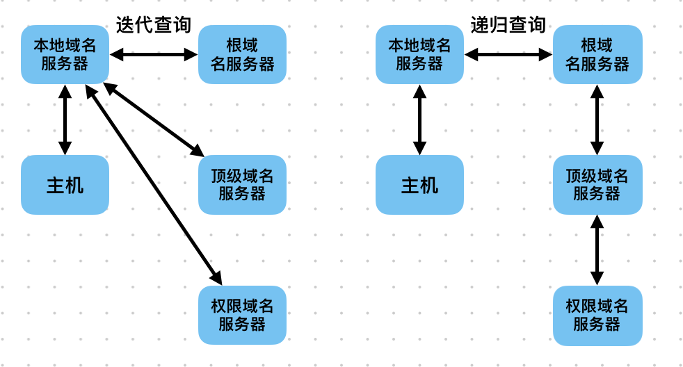

# Computer Networking

WAN: Wide Area Network

LAN: Local Area Network

WLAN: Wireless Local Area Network

| 5层模型    | 7层模型                |
| ---------- | ---------------------- |
| 应用层     | 应用层、表示层、会话层 |
| 传输层     | 传输层                 |
| 网络层     | 网络层                 |
| 数据链路层 | 数据链路层             |
| 物理层     | 物理层                 |

## 第4章 网络层  

网络层的主要任务是将IP数据报（IP分组）从源端发送到目的端，为分组交换网内的不同主机提供通信服务。
网络层的传输单位是IP数据报（fragment）

功能

1.   路由选择与分组转发
2.   异构网络互联
3.   拥塞控制：开环控制（静态方法）、闭环控制（动态方法）

### 4.1 SDN

软件定义网络（SDN、Software-Defined Networking）

路由器的功能

-   转发 / 数据平面：根据转发表，将路由器的一条输入链路上的IP数据报转发到路由器的一条输出链路上
-   路由选择 / 控制平面：控制IP数据报从源主机到目的主机的端到端路径上，路由器间的路由方式
    -   传统方法：路由器负责转发、路由选择
        路由器通过交换路由选择报文，计算转发表和路由表
        路由器上的路由选择处理器运行路由协议，负责维护链路信息、计算转发表与路由表
    -   SDN方法：路由器只负责转发（数据平面）
        SDN远程控制器（可编程）负责计算转发表和路由表，向路由器发送包括转发表和路由表的报文
        路由器上的路由选择处理器负责与SGN远程控制器通信，接收SDN远程控制器发送的报文

控制平面

1.   SDN远程控制器：管理网络范围状态信息（包括链路信息、路由器和主机的状态）向网络控制应用程序发送信息
2.   网络控制应用程序：接收SDN远程控制器发送的报文，网络控制应用程序监听、编程、控制网络络设备

SDN远程控制器的3个层次

-   面向网络控制应用程序的北向接口
-   网络范围状态管理层（路由协议）
-   与控制的网络设备间的通信（南向接口、通信层、通信协议）

### 4.2 IP数据报

TCP/IP协议栈

| HTTP | FTP  | DNS        |
| ---- | ---- | ---------- |
| TCP  | UDP  |            |
| ARP  | IP   | ICMP, IGMP |

IP数据报：首部|数据部分（TCP段/UDP段）

首部：固定部分|可变部分

首部的固定部分（20B）

-   版本0.5B、首部长度0.5B、服务类型1B、总长度2B（共4B）
    -   版本：0100
    -   首部长度：单位是4B，[20, 15*4=60]B
    -   总长度=首部长度+数据部分长度，单位是1B，[20, 2^16-1]B
-   标识2B、标志3 bits、片偏移13 bits（共4B）
    -   标识：属于同一个数据报的分片，标识相同
    -   标志：x__只有2位有意义
        中间位DF（Don't Fragment）DF=1禁止分片；DF=0允许分片
        最低位MF（More Fragment）MF=1后续还有分片；MF=0后续没有分片
    -   片偏移：数据报过大时，分片后该片在原数据报中的位置，单位是8B（每片长度都是8B的整数倍）
    
-   生存时间1B、协议1B、首部检验和2B（共4B）
    -   生存时间TTL：ip数据报的Time To Live ，经过一个路由器TTL-1，TTL=0时丢弃
    -   协议：数据部分使用的协议
    -   首部检验和：检验首部 

-   源IPv4地址（4B）
-   目的IPv4地址（4B）

首部的可变部分

-   可选字段（长度可变0~40B）
-   0填充：保证首部长度为4B的整数倍

| 协议名 | ICMP | IGMP | TCP  | EGP  | IGP  | UDP  | IPv6 | ESP  | OSPF |
| ------ | ---- | ---- | ---- | ---- | ---- | ---- | ---- | ---- | ---- |
| 字段值 | 1    | 2    | 6    | 8    | 9    | 17   | 41   | 50   | 89   |

IP数据报过大时分片，分片长度=最大传输单元MTU
最大传输单元MTU：数据链路层封装的数据的最大长度，以太网的MTU = 1500B

|          | MTU = 1420B              | 总长度 | DF   | MF   | 片偏移         |
| -------- | ------------------------ | ------ | ---- | ---- | -------------- |
| 原数据报 | 首部20B \| 数据部分3800B | 3820   | 0    | 0    | 0              |
| 分片1    | 首部20B \| 数据部分1400B | 1420   | 0    | 1    | 0              |
| 分片2    | 首部20B \| 数据部分1400B | 1420   | 0    | 1    | 1420 / 8 = 175 |
| 分片3    | 首部20B \| 数据部分1000B | 1020   | 00   | 0    | 2820 / 8 = 350 |

### 4.3 IPv4

IP地址：网络号|主机号，唯一的32位/4字节的标识符

分类的IP地址

| 分类的IP地址 | 首字节    | 网络号                             | 子网掩码      |
| ------------ | --------- | ---------------------------------- | ------------- |
| A类          | 0 ~ 126   | 0xxx_xxxx (1B)                     | 255.0.0.0     |
| B类          | 128 ~ 191 | 10xx_xxxx xxxx_xxxx (2B)           | 255.255.0.0   |
| C类          | 192 ~ 223 | 110x_xxxx xxxx_xxxx xxxx_xxxx (3B) | 255.255.255.0 |
| D类          | 224 ~ 239 | 1110 ... 多播地址                  |               |
| E类          | 240 ~ 255 | 1111 ... 保留                      |               |

| 地址类别 | 最大可用网络号数 | 不可用的网络号 | 第一个可用的网络号 | 最后一个可用的网络号 | 每个网络上的最大主机数 | 不可用的主机号（全0、全1） |
| -------- | ---------------- | -------------- | ------------------ | -------------------- | ---------------------- | -------------------------- |
| A类      | 2^7 - 2          | 0, 127         | 1                  | 126                  | 2^24 - 2               | 0.0.0, 255.255.255         |
| B类      | 2^14             |                | 128.0              | 191.255              | 2^16 - 2               | 0.0, 255.255               |
| C类      | 2^21             |                | 192.0.0            | 223.255.255          | 2^8 - 2                | 0, 255                     |

特殊的IP地址

| 网络号NetID     | 主机号HostID | 作为源地址 | 作为目的地址 |                                                |
| --------------- | ------------ | ---------- | ------------ | ---------------------------------------------- |
| 全0             | 全0          | 可以       | 不可以       | 0.0.0.0 表示本机（路由表中表示默认路由）       |
| 全0             | 某个值       | 可以       | 不可以       | 表示本网的某个主机                             |
| 全1             | 全1          | 不可以     | 可以         | 255.255.255.255 有限广播地址（本网广播地址）   |
| 某个值          | 全0          | 不可以     | 不可以       | 网络地址，表示某个网络                         |
| 某个值          | 全1          | 不可以     | 可以         | 直接广播地址，用于对某个网络的所有主机进行广播 |
| 127 (0111 1111) | 非全0、非全1 | 可以       | 可以         | 例127.0.0.1 环回地址，用于对本机进行环回测试   |

私有IP地址   

| 地址类别 | 地址范围                      | 网段个数（网络号个数） |
| -------- | ----------------------------- | ---------------------- |
| A类      | 10.0.0.0 ~ 10.255.255.255     | 1                      |
| B类      | 172.16.0.0 ~ 172.31.255.255   | 16                     |
| C类      | 192.168.0.0 ~ 192.168.255.255 | 256                    |

### 4.4 网络地址转换

网络地址转换（NAT、Network Address Translation）

-   NAT路由器不转发目的地址是私有IP地址的IP数据报
-   NAT路由器至少有一个公有IP地址

| NAT转换表                         |                                 |
| --------------------------------- | ------------------------------- |
| WAN/Internet/公网/外网 IP、端口号 | LAN/专用网/私网/内网 IP、端口号 |
| 221.226.84.186:18022              | 192.168.0.65:2280               |

### 4.5 子网划分与子网掩码

分类的IP地址的缺点：A类、B类IP地址空间的利用率低

子网划分：网络号|主机号（2级IP地址） => 网络号|子网号|主机号（3级IP地址）

-   主机号不可以全0、全1，主机号至少有2位
-   子网号可以全0、全1

子网掩码：主机号全1、子网号全1、主机号全0

将IP地址与子网掩码按位与，得到子网的网络地址

| 1000_0000 | 128  |
| --------- | ---- |
| 1100_0000 | 192  |
| 1110_0000 | 224  |
| 1111_0000 | 240  |
| 1111_1000 | 248  |
| 1111_1100 | 252  |
| 1111_1110 | 254  |
| 1111_1111 | 255  |

| IP地址                | 142.14.72.24  | 1000_1110 0000_1110 0100_1000 0001_1000 |
| --------------------- | ------------- | --------------------------------------- |
| 子网掩码（子网号2位） | 255.255.192.0 | 1111_1111 1111_1111 1100_0000 0000_0000 |
| 子网的网络地址        | 142.14.64.0   | 1000_1110 0000_1110 0100_0000 0000_0000 |
| 子网掩码（子网号3位） | 255.255.224.0 | 1111_1111 1111_1111 1110_0000 0000_0000 |
| 子网的网络地址        | 142.14.64.01  | 1000_1110 0000_1110 0100_0000 0000_0000 |

### 4.6 无分类编址

无分类编址（CIDR、Classless Inter-Domain Routing）

无分类编址：网络前缀|主机号

1.   无分类编址：IP地址/网络前缀的位数，例128.14.35.7/20
2.   CIDR将网络前缀相同的连续的IP地址组成一个CIDR地址块

| 例128.14.35.7/20                                  | 1000_0000 0000_1110 0010_0011 0000_0111                   |
| ------------------------------------------------- | --------------------------------------------------------- |
| CIDR地址块中的最小地址（主机号全0，表示网络地址） | 1000_0000 0000_1110 0010_0000 0000_0000, 128.14.32.0/20   |
| CIDR地址块中的最大地址（主机号全1，表示广播地址） | 1000_0000 0000_1110 0010_1111 1111_1111, 128.14.47.255/20 |
| CIDR地址块（/20地址块）                           | 1000_0000 0000_1110 0010_0000 0000_0000, 128.14.32.0/20   |
| 地址掩码（网络掩码）                              | 1111_1111 1111_1111 1111_0000 0000_0000, 255.255.240.0    |

构成超网（路由聚合）：取公共网络前缀，将多个子网聚合成一个较大的子网

例：某路由表中有4条路由表项，目的网络地址分别为35.230.32.0/21, 35.230.40.0/21, 35.230.48.0/21, 35.230.56.0/21，路由聚合后的目的网络地址为35.230.32.0/19

35.230.0010_0000.0
35.230.0010_1000.0
35.230.0011_0000.0
35.230.0011_1000.0

最长前缀匹配：使用CIDR时，将目的地址与子网掩码按位与，选择匹配的、公共网络前缀最长的子网

例：目的地址132.19.237.5 (132.0001_0011.1110_1101.5)，选择子网b

|       | 网络地址        | 子网掩码            | 按位与              |
| ----- | :-------------- | ------------------- | :------------------ |
| 子网1 | 132.0.0.0/8     | 255.0.0.0           | 132.0.0.0 匹配      |
| 子网2 | 132.0.0.0/11    | 255.1110_0000.0.0   | 132.0.0.0 匹配      |
| 子网3 | 132.19.232.0/22 | 255.255.1111_1100.0 | 132.19.236.0 不匹配 |

### 4.7 ARP

地址解析协议（ARP、Address Resolution Protocol）

ARP：维护IP地址到MAC地址的映射，自动运行
ARP高速缓冲区：存储IP地址与MAC地址的映射

|   应用层   |                       pdf                       |           报文（message）            |
| :--------: | :---------------------------------------------: | :----------------------------------: |
|   传输层   |                      分段                       |       包、报文、报文段、数据报       |
|   网络层   |             加源IP地址、目的IP地址              | package, message, segement, datagram |
| 数据链路层 | 加源MAC地址、目的MAC地址、FCS帧检验序列（帧尾） |             帧（frame）              |
|   物理层   |                                                 |                 bit                  |

src -> router -> dest

```py
# get router.mac（src广播ARP请求分组）
src.broadcast(srcIp=src.ip, destIp=router.ip, currMac=src.mac, nextMac=FF-FF-FF-FF-FF-FF)
router.response(nextIp=router.ip, nextMac=router.mac);
src.request(srcIp=src.ip, destIp=dest.ip, currMac=src.mac, nextMac=router.mac)

# get dest.mac（router广播ARP请求分组）
router.broadcast(srcIp=router.ip, destIp=dest.ip, currMac=router.mac. nextMac=FF-FF-FF-FF-FF-FF)
dest.response(nextIp=dest.ip. nextMac= dest.mac)
router.request(srcIp=src.ip. destIp=dest.ip, currMac=router.mac, nextMac=dest.mac)
```

源主机查找ARP高速缓冲区，如果有目的主机的mac地址则写入mac帧；如果没有目的主机的mac地址，则将FF-FF-FF-FF-FF-FF写入mac帧，并广播ARP请求分组。局域网的所有主机都可以收到请求，目的主机收到请求后，向源主机单播ARP响应分组，源主机收到响应后，更新ARP高速缓冲区

ARP的2种情况

1.   主机a -> 本网络上的主机b
     使用ARP找到主机b的mac地址
2.   主机a -> 另一个网络上的主机b
     使用ARP找到本网络的某个路由器的mac地址
     使用ARP找到另一个网络的某个路由器的mac地址
     使用ARP找到主机b的mac地址

例：主机A向主机B发送IP数据报，经过5个路由器，使用6次ARP

### 4.8 DHCP

静态配置
动态配置：动态主机配置协议（DHCP、Dynamic Host Configuration Protocol）

1.   DHCP是应用层协议，基于（无连接的）UDP
2.   DHCP使用客户服务器模型，客户端和服务器端使用广播方式进行通信
3.   DHCP提供即插即用的联网机制，主机可以从DHCP服务器动态获取IP地址、子网掩码、默认网关、DNS服务器等，支持地址续租、地址重用、支持移动用户加入网络
4.   主机广播DHCP发现报文 -> DHCP服务器广播DHCP提供报文 -> 主机广播DHCP请求报文 -> DHCP服务器广播DHCP确认报文

### 4.9 ICMP

网际控制报文协议（ICMP、Internet Control Message Protocol）

-   ICMP的5种差错报告报文
    -   终点不可达：路由器或主机不能交付数据报时，向源点发送终点不可达报文
    -   源点抑制（deprecated）：拥塞时，路由器或主机丢弃数据报，并向源点发送源点抑制报文
    -   时间超过：路由器或主机收到生存时间TTL为0的数据报时，丢弃数据报，并向源点发送时间超过报文；终点在规定时间内未收到数据报的所有数据报片时，丢弃已收到的部分数据报片，并向源点发送时间超过报文
    -   参数问题：路由器或主机收到的数据报中，首部的字段值有错时，丢弃数据报，并向源点发送参数问题报文
    -   重定向：路由器将重定向报文发送给主机，通知主机将数据报发送给别的路由器（优化路由）
-   不返回ICMP差错报告报文的情况
    -   对于ICMP差错报告报文，不再返回ICMP差错报告报文
    -   对于第一个数据报片的所有后续数据报片，不再返回ICMP差错报告报文
    -   对有组播地址的数据报，不返回ICMP差错报告报文
    -   对有特殊地址的数据报（例0.0.0.0或127.0.0.0），不返回ICMP差错报告报文
-   ICMP的4种询问报文
    -   Echo请求与回答报文（Echo Request and Reply Message）
    -   Timestamp请求与回答报文（Timestamp Request and Reply Message）
    -   Address mask请求与回答报文（Address Mask Request and Reply Message）
    -   Router询问与通知报文（Router Solicitation and Advertisement Message）
        询问与通知都使用广播

ping工作在应用层，直接使用网络层的ICMP（ICMP回送请求和回答报文），不使用传输层的TCP/UCP，用于检测主机间的连通性

```
$ ping 221.226.84.186
PING 221.226.84.186 (221.226.84.186) 56(84)B of data.
64B from 221.226.84.186: icmp_seq=1 ttl=55 time=14.0 ms
```

### 4.10 IPv6

网络地址转换NAT、无分类编制CIDR不能根本解决IPv4地址耗尽问题
IPv6可以根本解决IPv4地址耗尽问题

-   IPv6地址（128位）
-   删除服务类型字段
-   删除总长度字段，改为有效载荷长度字段
-   删除协议字段，改为下一个首部字段
-   删除首部检验和，减少每跳的处理时间
-   删除可选字段，改为扩展首部。路由器不检查扩展首部，减少每跳的处理时间
-   支持即插即用（自动配置，无需DHCP协议）
-   支持资源预分配
-   IPv6在主机上可以分片，在路由器上不可以分片：路由器收到的分组过大时，丢弃分组，返回ICMPv6差错报告报文（分组过大）
    IPv4在主机、路由器上都可以分片
-   IPv6首部长度是8B的整数倍
    IPv4首部长度是4B的整数倍

IPv6数据报：基本首部40B | 有效载荷

基本首部

-   版本0.5B、优先级1B、流标签2.5B
    -   版本：0110
    -   流标签：属于同一个流的数据报，流标签相同
-   有效载荷长度2B、下一个首部1B、跳数限制1B
    -   下一个首部：指向下一个扩展首部或数据部分
    -   跳数限制：类比IPv4的TTL

-   源IPv6地址16B
-   目的IPv6地址16B

有效载荷：扩展首部1~N | 数据部分

| 冒号十六进制计法                              | `fe80:0000:0000:0000:0585:005b:000b:d8d4` |
| --------------------------------------------- | ----------------------------------------- |
| 压缩                                          | `fe80:0:0:0:585:5b:b:d8d4​`                |
| 零压缩，连续的0可以压缩为::（只能零压缩一次） | `fe80::585:5b:b:d8d4`                     |

IPv6地址类型

| IPv6地址类型 | 用于                                  | 源地址 | 目的地址 |
| ------------ | ------------------------------------- | ------ | -------- |
| 单播地址     | 一 对 一 通信                         | √      | √        |
| 多播地址     | 一 对 多 通信                         | ×      | √        |
| 任播地址     | 一个结点 对 一组结点中的任意一个 通信 | ×      | √        |

IPv6向IPv4过渡的策略

-   双栈协议：同时使用IPv4协议栈和IPv6协议栈
-   隧道技术：隧道中传递的数据可以是不同协议的数据帧（数据链路层）或数据包（网络层）
    方法：将不同协议的数据帧或数据包重新封装，通过隧道传递

### 4.11 路由协议与路由算法

路由表：目的网络IP地址 | 子网掩码 | 下一跳IP地址 | 接口

路由算法

-   静态路由算法（非自适应路由算法）手工创建路由表项
-   动态路由算法（自适应路由算法）使用路由算法更新路由表项
    -   分散性：距离-向量算法
    -   全局性：链路状态算法

分层次的路由协议

自治系统（AS、Autonomous System）一组路由器

-   内部网关协议IGP：AS内使用（RIP、OSPF）
-   外部网关协议EGP：AS间使用（BGP）

#### 4.13.1 RIP和距离-向量算法

路由信息协议（RIP、Routing Information Protocol）

-   基于分布式距离-向量算法的路由协议，每个路由器维护到每个目的网络的唯一最佳路径
-   跳数（距离）：从源端口到目的端口经过的路由器个数。特别的，从路由器到直接连接的网络距离为1
    RIP要求跳数小于16，即一条路径上最多有15个路由器，跳数为16表示网络不可达
-   RIP简单，适用于小型网络

Net1 == R1 == Net2 == R2 == Net3 == R3 == Net4
R2的路由表

| 目的网络               | 跳数 | 下一跳   |
| ---------------------- | ---- | -------- |
| Net1                   | 2    | R1       |
| Net2（直接连接的网络） | 1    | 直接交付 |
| Net3（直接连接的网络） | 1    | 直接交付 |
| Net4                   | 2    | R3       |

1.   每隔30s，路由器和相邻路由器交换并更新路由表
1.   若超过180s，路由器未收到相邻路由器的路由表，则判断相邻路由器宕机，并更新路由表

距离-向量算法

R1 == Net1 == R2 == Net2 == R3 == Net3

1.   路由器R1收到相邻路由器R2的RIP报文，修改RIP报文：将跳数字段+1，并将下一跳字段修改为X，
     例：`Net3 | 2 | R3` => `Net3 | 3 | R2`
2.   对于修改后的RIP报文，例
     1.   R1的路由表中没有Net3：插入表项
     2.   R1的路由表中有Net3，且下一跳是X：更新表项（中的跳数字段）
     3.   R1的路由表中有Net3，且下一跳不是X：若RIP报文中的跳数更小，则更新表项
3.   若超过180s，路由器R1未收到相邻路由器R2的RIP报文，则将下一跳为R2的表项中的跳数字段更新为16
     例：`Net3 | 3 | R2` => `Net3 | 16 | R2`

```json
{
	"IP head": "...",
	"IP data": {
		"UDP head": "...",
		"UDP data": {
			"RIP head": "...",
			"RIP data": "..."
		}
	}
}
```

-   RIP是应用层协议，通过UDP发送，即RIP报文是UDP报文的数据部分
-   网络故障时，RIP收敛慢（收敛：将故障信息传递给所有的路由器）

#### 4.13.2 OSPF和链路状态算法

开放式最短路径优先（OSPF、Open Shortest Path First）

-   基于分布式链路状态算法的路由协议
-   链路状态改变时，路由器使用洪泛法向所有路由器发送链路状态信息（即本路由器与相邻的所有路由器的链路状态信息）
-   OSPF适用于大规模网络

**OSPF的5种分组类型**

1.   问候分组：发现邻站、确认邻站的可达性
2.   数据库描述分组：向邻站发送本站的链路状态数据库中，所有链路状态项的摘要
3.   链路状态请求分组：有新摘要时，邻站返回链路状态请求分组
4.   链路状态更新分组：收到邻站返回的链路状态请求分组后，本站使用洪泛法向所有路由器发送链路状态更新分组
5.   链路状态确认分组：邻站链路状态数据库更新后，返回链路状态确认分组进行确认
6.   根据链路状态数据库，使用Dijkstra算法计算本站到其他站的最短路径
7.   每隔30s，刷新一次链路状态数据库

```json
{
	"IP head": "...",
	"IP data": {
		"OSPF head": "...",
		"OSPF data": "..."
	}
}
```

-   OSPF是网络层协议，通过IP发送，即OSPF报文是IP数据报的数据部分
-   网络故障时，OSPF收敛快

#### 4.13.3 BGP

边界网关协议（BGP、Border Gateway Protocol）使用算法，支持CIDR

每个AS选择至少一个路由器作为本AS的BGP发言人，与其他AS的BGP发言人交换网络可达性信息
每个BGP发言人既要运行外部网关协议BGP，又要运行本AS的内部网关协议RIP/OSPF

网络可达性改变时：

1.   建立TCP连接（BGP是应用层协议，通过TCP发送，即BGP报文是TCP报文的数据部分）
2.   交换BGP报文以建立BGP会话
3.   通过BGP会话交换网络可达性信息（即到达某个网络经过的一系列AS）
4.   BGP发言人选择到达其他AS的较好路由

BGP-4的4种报文

1.   Open打开报文：与相邻的BGP发言人建立BGP会话
1.   Update更新报文：发送新路由、撤销旧路由
1.   Keepalive保活报文：确认Open打开报文、确认相邻的BGP发言人的连通性
1.   Notification通知报文：差错报告、关闭TCP连接

3种路由协议的比较

| 协议     | RIP                  | OSPF                                     | BGP                                                  |
| -------- | -------------------- | ---------------------------------------- | ---------------------------------------------------- |
| 类型     | 内部网关协议         | 内部网关协议                             | 外部网关协议                                         |
| 路由算法 | 距离-向量算法        | 链路状态算法                             | 距离-向量算法                                        |
| 传递协议 | UDP广播              | IP                                       | TCP                                                  |
| 路径选择 | 跳数最少             | 代价最小                                 | 较好                                                 |
| 交换结点 | 相邻的路由器         | 所有路由器                               | 相邻的BGP发言人                                      |
| 交换内容 | 本路由器的全部路由表 | 本路由器与相邻的所有路由器的链路状态信息 | 首次交换全部路由表，后续交换发生改变的网络可达性信息 |

### 4.12 IP组播

| 单播         | 点 对 点 的传输方式     |
| ------------ | ----------------------- |
| 广播         | 点 对 所有点 的传输方式 |
| 组播（多播） | 点 对 多个点 的传输方式 |

1.   目的主机使用Internet网组管理协议（IGMP、Internet Group Management Protocol）加入组播组
2.   源主机（源地址是单播地址）组播时将一个分组发送给组播地址，该组播地址标识一个组播组（若干目的主机）。只有发送路径上遇见分岔时，才复制分组再继续转发。可以运行组播协议的路由器称为组播路由器
3.   组播地址范围为224.0.0.0~239.255.255.255（D类地址）一个D类地址标识一个组播组
4.   组播数据报使用UDP，尽最大努力交付，不提供可靠交付
     D类地址只能作为目的地址
     对于组播数据报，不返回ICMP差错报告报文（ping组播地址时，无响应）
     部分D类地址不能作为组播地址

IP组播分为：在本局域网内进行硬件组播、在Internet范围内进行组播

#### 4.12.1 在局域网内进行硬件组播

48位mac地址的前24位等于01-00-5e，第25位等于0，后23位等于D类IP地址的后23位
组播IP地址与组播mac地址不是一一对应的：主机收到组播数据报后，需要在IP层进行软件过滤，丢弃不期望接收的数据报

| IPv4                         | mac               |
| ---------------------------- | ----------------- |
| 224.128.64.32 -> e0-80-40-20 | 01-00-5e-00-40-20 |
| 224.0.64.32   -> e0-00-40-20 | 01-00-5e-00-40-20 |

#### 4.12.2 在Internet范围内进行组播

Internet网组管理协议（IGMP、Internet Group Management Protocol）通知组播路由器，本局域网内是否有主机加入或退出某个组播组
ICMP和IGMP都使用IP数据报传递报文

1.   主机加入某个组播组时，主机向该组的组播地址发送IGMP报文，声明加入该组。本地组播路由器收到IGMP报文后，将组成员关系转发给Internet上的外地组播路由器（组成员关系：组播路由器连接的局域网内有无该组的成员）
2.   组播路由器周期性询问连接的局域网内的组成员，若至少有一个主机响应，则判断该组活跃；若没有主机响应，则判断该组不活跃，停止将该组的组成员关系转发给Internet上的其他组播路由器

组播路由选择协议：Internet上的组播路由器协同工作，将组播数据报以最小代价发送给组播组的所有成员，即找到以源主机位根结点的组播转发树。源点或组播组不同，对应的组播转发树不同

组播使用的路由算法

-   距离-向量算法、链路状态算法
-   协议无关的组播（PIM、Protocol Independent Multicast）

### 4.13 移动IP

三种功能实体：移动结点、本地代理、外地代理

-   移动结点：拥有永久IP地址的移动站
-   本地代理：连接本地网络（归属网络）的路由器
-   外地代理：连接外地网络（被访网络）的路由器

移动IP通信过程

1.   移动站在归属网络收发消息时，使用TCP/IP通信
2.   移动站漫游到外地网络时，移动站向外地代理登记、分配临时的转交地址，外地代理向移动站的归属代理登记该转交地址
3.   归属代理封装收到的、发送给移动站的IP分组，通过隧道发送给外地代理
4.   外地代理拆封IP分组，发送给移动站
5.   移动站在外地网络发送消息时，使用本机的永久IP地址作为源地址，直接通过外部代理进行转发
6.   移动站回到归属网络时，移动站向归属代理注销该转交地址

### 4.14 路由器

-   冲突域：连接同一个物理层器件的结点集合。冲突域是物理层概念，物理层器件（集线器、中继器）不可以划分冲突域，数据链路层设备（网桥、交换机）和网络层设备（路由器）可以划分冲突域

-   广播域：接收同一条广播消息的结点集合。广播域是数据链路层概念，物理层器件（集线器、中继器）和数据链路层设备（网桥、交换机）不可以划分广播域，网络层设备（路由器）可以划分广播域。
-   局域网：使用路由器划分的广播域

路由器：有多个输入/输出端口的专用计算机，用于异构网络互联、路由选择与分组转发

-   路由选择部分：构造、维护路由表
-   分组转发部分：由交换结构、一组输入端口和一组输入端口组成，通过查找转发表（由路由表构造得到）进行分组转发，转发表项包括目的网络与输出端口、下一跳mac地址的映射
    输入端口：bit流 -> 帧 -> 数据报；输出端口：数据报 -> bit流 -> 帧
-   面向协议（OSI、TCP/IP、IPX）

本局域网内通信无需路由器的转发（直接交付），跨局域网络通信需要路由器的转发（间接交付）

## 第5章 传输层

1.   提供进程与进程间的逻辑通信
2.   复用与分用
     1.   复用：发送方传输层将套接字Socket封装到报文段，交付给网络层
     2.   分用：接收方传输层根据报文段中的套接字Socket，交付给应用层（套接字）

3.   对收到的报文进行差错检测

传输层的两个协议

-   面向连接的传输控制协议（TCP、Transmission Control Protocol）可靠，面向连接、时延大，适用于大文件
-   无连接的用户数据报协议（UDP、User Datagram Protocol）不可靠、无连接、时延小，适用于小文件

端口号：标识主机上的某个进程，长度16bit（端口号0~65535）

-   服务器端使用的端口号：0~49151
-   客户端使用的端口号：49152~65535

| 特殊的TCP端口号                      |      | 特殊的UDP端口号 |      |
| ------------------------------------ | ---- | --------------- | ---- |
| 文件传输协议FTP                      | 20   | 域名系统DNS     | 53   |
| 安全外壳SSH                          | 22   |                 |      |
| 简单邮件传输协议SMTP                 | 25   |                 |      |
| 超文本传输协议HTTP                   | 80   |                 |      |
| 安全超文本传输协议HTTPS              | 443  |                 |      |
| MySQL数据库                          | 3306 |                 |      |
| 代理（VPN、Virtual Private Network） | 8080 |                 |      |

套接字Socket = (主机IP地址, 端口号) 套接字唯一标识网络中的某个主机上的某个进程

### 5.1 UDP

用户数据报协议（UDP、User Datagram Protocol）

-   无连接
-   尽最大努力交付，不提供可靠交付
-   面向报文，不调整应用层传递的报文，适合传输少量数据
-   无拥塞控制，适合实时应用
-   UDP首部8B，开销小；TCP首部>=20B，开销大

UDP首部

-   源端口号2B：可以为空（全0）
-   目的端口号2B
-   总长度
-   UDP检验和16b：检验UDP数据报是否有错（使用伪首部）有错则丢弃
    伪首部：源IP地址 4B、目的IP地址 4B、保留 1B、UDP协议字段17 1B、UPD报文总长度 2B

分用时，若未找到目的端口号，则丢弃报文，并返回“端口不可达”ICMP差错报告报文

```json
{
	"IP head": "...",
	"IP data": {
		"UDP head": "...",
		"UDP data": "..."
	}
}
```

### 5.2 TCP

-   TCP是面向连接（虚连接）的、端到端的传输层协议
-   TCP提供可靠传输：无差错、不重复、不丢失、保证有序
-   TCP提供全双工通信
    -   发送缓冲区：等待发送的数据、已发送但未收到确认的数据
    -   接收缓冲区：按序到达但未被套接字读取的数据、乱序到达的数据
-   TCP面向字节流

#### 5.2.1 TCP首部

首部的固定部分20B

-   源端口2B、目的端口2B
-   序号seq_num 4B：TCP字节流中，字节按序编号。表示本报文段的数据部分的首字节的序号
-   确认号ack_num 4B：期望收到的下一个报文段的数据部分的首字节的序号。若确认号为n，则表示序号为n的字节前的所有字节已正确收到
-   数据偏移4 bits：表示数据部分在本报文段中的偏移（即首部长度20B~60B），单位4B
-   保留6 bits
-   紧急位（URG、Urgent）URG=1 => 有紧急数据，无需在缓冲区队列中排队
    确认位（ACK、Acknowledge）ACK=1 => 确认建立连接
    推送位（PSH、Push）PSH=1 => 接收方尽快向套接字交付，不等待缓冲区满时再向套接字交付
    复位（RST、Reset）RST=1 => TCP连接严重错误，必须先终止连接，再重新建立连接
    同步位（SYN、Synchronize）SYN=1 => 本报文段是连接请求/连接确认报文段
    终止位（FIN、Finish）FIN=1 => 终止发送方到接收方的单向TCP连接
-   窗口 2B：发送本报文段的主机的接收窗口（RWND、Reciever Window）
-   检验和2B：检验首部和数据部分（使用伪首部）
    伪首部：源IP地址 4B、目的IP地址 4B、保留 1B、TCP协议字段6 1B、TCP报文总长度 2B
-   紧急指针2B：URG=1时，表示紧急数据的字节数

首部的可变部分

-   可选字段（长度可变）最大报文段长度MSS、时间戳等
-   0填充：保证首部长度为4B的整数倍

```json
{
	"IP head": "...",
	"IP data": {
		"TCP head": "...",
		"TCP data": "..."
	}
}
```

#### 5.2.2 TCP连接的建立与终止

TCP连接的三个阶段：建立连接 -> 传输数据 -> 终止连接，建立连接使用客户服务器模型：主动建立连接的进程是客户，被动等待建立连接的进程是服务器

客户端的一个进程与服务器端的一个进程建立TCP连接

```cpp
/**
 * 建立TCP连接：3次握手
 * seq_num序号：TCP字节流中，字节按序编号。表示本报文段的数据部分的首字节的序号
 * ack_num确认号：期望收到的下一个报文段的数据部分的首字节的序号。若确认号为n，则表示序号为n的字节前的所有字节已正确收到
 * ACK确认位：ACK=1 => 确认建立连接
 * SYN同步位：SYN=1 => 本报文段是连接请求/连接确认报文段
 */
void connection_establish() {
  	// 客户端向服务器端发送连接请求报文段，无数据部分，x随机
    client >> synchronization_request{SYN = 1, seq_num = x} >> server;
    // 服务器端为TCP连接分配变量、缓冲区
    // 服务器端向客户端发送连接确认报文段，无数据部分，y随机
    server >> synchronization_acknowledge{SYN = 1, seq_num = y, ACK = 1, ack_num = x + 1} >> client;
    // 客户端为TCP连接分配变量、缓冲区
  	// 客户端向服务器端返回确认的确认，可以携带数据
    client >> segment{SYN = 0, seq_num = x + 1, ACK = 1, ack_num = y + 1, data="data"} >> server;
}
```

SYN洪泛攻击：服务器端返回连接确认报文后，攻击者（客户端）不返回确认的确认，TCP连接挂起。服务器端未收到确认的确认，重复发送连接确认报文段。攻击者请求大量TCP连接，大量TCP连接挂起，导致服务器宕机

终止TCP连接

```cpp
/**
 * 终止TCP连接：4次挥手
 * seq_num序号：TCP字节流中，字节按序编号。表示本报文段的数据部分的首字节的序号
 * ack_num确认号：期望收到的下一个报文段的数据部分的首字节的序号。若确认号为n，则表示序号为n的字节前的所有字节已正确收到
 * ACK确认位：ACK=1 => 确认建立连接
 * FIN终止位：FIN=1 => 请求终止发送方到接收方的单向TCP连接
 */
void connection_terminate() {
    // 客户端发送FIN终止报文段，无数据部分，请求终止客户端到服务器端的单向TCP连接
    client >> FIN{FIN = 1, seq_num = u} >> server;
    // 服务器端返回ACK确认报文段，无数据部分，终止客户端到服务器端的单向TCP连接
    // 服务器端发送剩余报文段
    server >> ACK{ACK = 1, ack_num = u + 1, seq_num = v} >> client;
    // 服务器端发送FIN终止报文段，无数据部分，请求服务器端到客户端的单向TCP连接
    server >> FIN{FIN = 1, ACK = 1, ack_num = u + 1, seq_num = w} >> client;
    // 客户端返回ACK确认报文段，无数据部分，等待2MSL后，终止服务器端到客户端的单向TCP连接
    // 最长报文段寿命（MSL、Maximum Segment Lifetime）
    client.wait(2 * MSL);
    client >> ACK{ACK = 1, ack_num = w + 1, seq_num = u + 1} >> server;
}
```

#### 5.2.3 TCP可靠传输

网络层：尽最大努力交付，不可靠传输

传输层

-   TCP：可靠传输 -> 无差错、不重复、不丢失、保证有序（发送方进程发送的字节流与接收方进程收到的字节流相同）
-   UDP：尽最大努力交付，不可靠传输

可靠传输的实现

1.   检验和：检验首部和数据部分（使用伪首部）
2.   序号seq_num 4B：TCP字节流中，字节按序编号。表示本报文段的数据部分的首字节的序号
3.   确认号ack_num 4B：期望收到的下一个报文段的数据部分的首字节的序号。若确认号为n，则表示序号为n的字节前的所有字节已正确收到
4.   超时重传：发送方在规定时间（即超时重传时间）内未收到已发送的报文段的确认，则重传已发送的报文段
     TCP使用自适应算法，动态调整超时重传时间
     1.   往返时间（RTT、Round-Trip Time）
     2.   平滑往返时间（RTTs、Smoothed Round-Trip Time）RTT的加权平均
     3.   超时重传时间（RTO、Retransmission Timeout）
5.   冗余确认：收到序号seq_num大于期望序号的失序报文段时，返回一个冗余ACK确认报文段，指明期望序号

#### 5.2.4 TCP流量控制

流量控制：控制发送方的发送速率

TCP通过滑动窗口实现流量控制：接收方设置ACK确认报文段的窗口字段 = RWND，动态调整发送方的发送窗口

-   接收窗口（RWND、Reciever Window）接收方的接收缓冲区大小
-   拥塞窗口（CWND、Congestion Window）发送方根据网络拥塞度，设置拥塞窗口值
-   发送窗口 = min(RWND, CWND) 发送方在收到接收方返回的ACK确认报文段前，可以发送的数据量

持续计时器：A端收到B端的0窗口报文段时，A端启动持续计时器。若A端在规定时间内未收到B端的窗口更新报文段，则A端发送窗口探测报文段，B端收到窗口探测报文段后，返回窗口更新报文段。若窗口仍为0，则A端重新启动持续计时器

#### 5.2.5  TCP拥塞控制

-   拥塞：资源需求量 > 可用资源
-   拥塞控制目的：防止过多数据注入到网络中
-   流量控制：端到端
    拥塞控制：全局性
-   拥塞控制算法
    -   TCP Tahoe 慢启动 + 拥塞避免（Slow Start + Congestion Avoidance）
        慢启动阈值（ssthresh、Slow Start Threshold）
    -   TCP Reno 快速重传 + 快速恢复（Fast Retransmit + Fast Recovery）

假设：

1.   数据A到B单向传递，B到A只传递ACK确认报文段
2.   接收方的接收缓冲区足够大，即发送窗口 = min(RWND, CWND) = CWND

| Slow Start + Congestion Avoidance                          | CWND / B           | seg_num (e.g. seg_size=1B) |
| ---------------------------------------------------------- | ------------------ | -------------------------- |
| RTT0 (Slow Start, ssthresh=16)                             | 1                  | 1                          |
| RTT1                                                       | 2                  | 2                          |
| RTT2                                                       | 4                  | 4                          |
| RTT3                                                       | 8                  | 8                          |
| RTT4 (Congestion Avoidance)                                | 16 (ssthresh)      | 16                         |
| RTT5                                                       | 17                 | 17                         |
| RTT6                                                       | 18                 | 18                         |
| ...                                                        |                    |                            |
| RTT12 (e.g. NETWORK CONGESTION)                            | 24 (congestedCWND) | 24                         |
| RTT13 (Slow Start,`ssthresh = congestedCWND/2; CWND = 1;`) | 1                  | 1                          |
| RTT14                                                      | 2                  | 2                          |
| RTT15                                                      | 4                  | 4                          |
| RTT16                                                      | 8                  | 8                          |
| RTT17 (Congestion Avoidance)                               | 12 (ssthresh)      | 12                         |
| RTT18                                                      | 13                 | 13                         |
| RTT19                                                      | 14                 | 14                         |
| ...                                                        |                    |                            |

例：发送方已发送seg1、seg2、seg3、seg4、seg5
接收方收到seg1，返回对seg1的ACK确认报文段（期望序号 = 确认号ack_num = 2的第一个字节的序号）
接收方收到seg3（未收到seg2），返回对seg1的冗余ACK确认报文段（指明期望序号 = 确认号ack_num = seg2的第一个字节的序号）
接收方收到seg4（未收到seg2），返回对seg1的冗余ACK确认报文段（指明期望序号 = 确认号ack_num = seg2的第一个字节的序号）
接收方收到seg5（未收到seg2），返回对seg1的冗余ACK确认报文段（指明期望序号 = 确认号ack_num = seg2的第一个字节的序号）
发送方收到3个对seg1的冗余ACK确认报文段，**快速重传**seg2，**快速恢复**`ssthresh = congestedCWND/2; CWND = ssthresh;`

## 第6章 应用层

应用层为进程通信提供服务

应用层协议：DNS, FTP, TFTP, SMTP, POP3, IMAP, HTTP, HTTPS

应用层模型

-   客户/服务器模型（C/S、Client/Server）
-   对等模型（P2P、Peer-to-Peer）：每个主机既可以请求服务，也可以提供服务

### 6.1 DNS

域名解析系统（DNS、Domain Name System）域名 => IP地址

-   顶级域名：国家顶级域名cn, eu, jp, hk, tw, us 通用顶级域名com, edu, gov, net, org
-   子域名：ac.jp, co.jp, edu.cn, com.cn

域名解析

-   递归查询
-   迭代查询

域名解析时，主机将DNS查询请求报文发送给本地域名服务器

-   根域名服务器：若本地域名服务器缓存未命中，则主机将DNS查询请求报文发送给根域名服务器
    根域名服务器（13个）存储顶级域名服务器的IP地址
-   顶级域名服务器：TLD服务器（com TLD服务器）存储权限域名服务器的IP地址
-   权限域名服务器：mihoyo.com权限域名服务器存储bh3.mihoyo.com, ys.mihoyo.com, sr.mihoyo.com, ...的IP地址



### 6.2 FTP, TFTP, SMTP, POP3, IMAP

都是客户/服务器模型，都使用TCP实现可靠传输

-   文件传输协议（FTP、File Transfer Protocol）
-   简单文件传输协议（TFTP、Trivial File Transfer Protocol）
-   简单邮件传输协议（SMTP、Simple Mail Transfer Protocol）
-   邮局协议（POP3、Post Office Protocol）
-   网际报文存取协议（IMAP、Internet Message Access Protocol）

### 6.3 万维网、HTTP

The **World Wide Web** is an information system that enables content sharing over the Internet through user-friendly ways. It allows documents and other web resources to be accessed over the Internet according to specific rules of the Hypertext Transfer Protocol (HTTP).

-   万维网（WWW、World Wide Web）
-   统一资源定位符（URL、Uniform Resource Locator）`<Protocol>://<Host>:<Port>/<Path>`
-   超文本传输协议（HTTP、HyperText Transfer Protocol）

浏览器发送DNS查询请求报文 -> 域名服务器返回DNS查询响应报文 -> 浏览器与网页服务器建立TCP连接 -> 浏览器发送HTTP请求报文，请求HTML文件 -> 网页服务器返回HTTP响应报文，响应HTML文件

HTTP特点

-   HTTP无状态（有状态 -> 使用Cookie：存储在用户端的文本文件，存储用户数据）
-   HTTP无连接（有连接 -> 使用TCP）
    -   持久连接Keep-alive：传输下一个文件无需重新3次握手，分为流水线、非流水线
        文件传输时间：RTT + 传输时间
    -   非持久连接Close：传输下一个文件需要重新3次握手
        文件传输时间：2*RTT + 传输时间

HTTP报文

-   HTTP请求报文：请求行、请求头、请求体（可选）
-   HTTP响应报文：响应行、响应头、响应体（可选）

|                       | HTTP请求报文        |                        | HTTP响应报文               |
| --------------------- | ------------------- | ---------------------- | -------------------------- |
| 请求行Request Line    | 方法、URL、HTTP版本 | 响应行Respond Line     | HTTP版本、状态码、状态信息 |
| 请求头Request Headers | 键值对              | 响应头Response Headers | 键值对                     |
| 请求体Request Body    |                     | 响应体Response Body    |                            |

```sh
telnet cis.poly.edu 80

GET /~ross/ HTTP/1.1
Host: cis.poly.edu
```

状态码

-   1XX 信息
-   2XX 成功 (202 Accepted)
-   3XX 重定向 (301 Moved Permanently)
-   4XX 客户端错误 (404 Not Found)
-   5XX 服务器端错误 (502 Bad Gateway)
