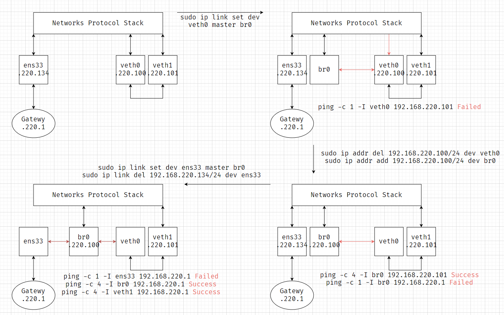

# Linux

### vim

```shell
# 命令模式
i|insert|a # 切换到插入模式
:          # 切换到命令行模式
x          # 删除当前字符
o          # 在下方插入行，并切换到插入模式
O          # 在上方插入行，并切换到插入模式
dd         # 剪切当前行
yy         # 复制当前行
P          # 光标后粘贴
p          # 光标前粘贴
u          # 撤销

# 输入模式
esc        # 切换到命令模式

# 命令行模式
:w         # 写文件
:q         # 退出
:wq        # 写文件并退出
:q!        # 强制退出
```

```sh
# ~/.vimrc
set cursorline
set mouse=a
set number
```

### Ubuntu-24.04

```shell
# WSL
wsl --install -d Ubuntu-24.04
wsl --list
wsl --set-default Ubuntu-24.04
wsl --shutdown
# wsl --unregister Ubuntu-24.04

cat /etc/issue
sudo apt update && sudo apt install vim
# sudo cp /etc/apt/sources.list /etc/apt/sources.list~
sudo cp /etc/apt/sources.list.d/ubuntu.sources /etc/apt/sources.list.d/ubuntu.sources~
# sudo vim /etc/apt/sources.list
sudo vim /etc/apt/sources.list.d/ubuntu.sources
sudo apt update && sudo apt upgrade && sudo apt-get update && sudo apt-get upgrade
sudo apt install apt-transport-https build-essential ca-certificates cmake curl gdb git maven net-tools ninja-build openssh-server pkg-config wget zsh

# git
git config --global user.name yukino && \
git config --global user.email 'yukino161043261@gmail.com' && \
git config --global core.autocrlf false && \
git config --global credential.helper store && \
git config --global init.defaultBranch main && \
ssh-keygen -t rsa -C 'yukino161043261@gmail.com'

# zsh
sh -c "$(curl -fsSL https://raw.githubusercontent.com/ohmyzsh/ohmyzsh/master/tools/install.sh)"
git clone https://github.com/zsh-users/zsh-autosuggestions.git $ZSH_CUSTOM/plugins/zsh-autosuggestions
git clone https://github.com/zsh-users/zsh-syntax-highlighting.git $ZSH_CUSTOM/plugins/zsh-syntax-highlighting

# graalvm
curl https://download.oracle.com/graalvm/21/latest/graalvm-jdk-21_linux-x64_bin.tar.gz -O

# python
sudo apt install python3.12 python3.12-venv python3-pip python3-virtualenv
python3 -m venv ~/venv

# vmware
sudo apt install open-vm-tools open-vm-tools-desktop
cd && rm -rf ~/.bash_history ~/.bash_logout ~/.bashrc ~/.profile ~/.bashrc ~/.shell.pre-oh-my-zsh ~/.bash_profile *.tar.gz

# Repair network
sudo lshw -c network
sudo service NetworkManager stop
sudo rm  /var/lib/NetworkManager/NetworkManager.state
sudo vim /etc/NetworkManager/NetworkManager.conf # managed=true
sudo service NetworkManager start
```

### ~/.zshrc

```shell
# zsh
export ZSH="$HOME/.oh-my-zsh"
ZSH_THEME="ys"
plugins=(git zsh-autosuggestions zsh-syntax-highlighting)
source "$ZSH/oh-my-zsh.sh"
export EDITOR="vim"

# admin
# export HTTP_PROXY="http://127.0.0.1:8080"
# export HTTPS_PROXY="http://127.0.0.1:8080"
# export ALL_PROXY="socks5://127.0.0.1:8080"

# c, cpp
# export CMAKE_GENERATOR="Unix Makefiles"

# java
export JAVA_HOME="$HOME/graalvm-jdk-21"
export PATH="$JAVA_HOME/bin:$PATH"
export M2_HOME="/usr/share/maven"
export PATH="$M2_HOME/bin:$PATH"

# js, ts
export NVM_DIR="$HOME/.nvm"
[ -s "$NVM_DIR/nvm.sh" ] && \. "$NVM_DIR/nvm.sh"
[ -s "$NVM_DIR/bash_completion" ] && \. "$NVM_DIR/bash_completion"

# python
export PATH="$HOME/venv/bin:$PATH"
```

### ssh

Secure Shell (SSH) Protocol

```shell
# client
cat ~/.ssh/id_rsa.pub | ssh tiancheng.hang@221.226.84.186 -p 18022 "mkdir -p ~/.ssh && cat >> ~/.ssh/authorized_keys"

# client
ssh tiancheng.hang@221.226.84.186 -p 18022
tiancheng@yudt12#$
ssh yudt@192.168.2.222
Yudt12#$

# vim ~/.ssh/config
Host thinkpad
    HostName 221.226.84.186
    User tiancheng.hang
    Port 18022
```

### .wslconfig

vim /mnt/c/Users/admin/.wslconfig

```sh
# vim /mnt/c/Users/admin/.wslconfig
[wsl2]
autoProxy=true
dnsTunneling=true
firewall=false
networkingMode=mirrored
[experimental]
autoMemoryReclaim=gradual # disabled|dropcache|gradual
# hostAddressLoopback=true

# windows
netsh advfirewall firewall add rule name="ssh" dir=in action=allow protocol=TCP localport=22
netsh advfirewall firewall delete rule name="ssh" protocol=TCP localport=22
```

### rsync

Remote Synchronous Copy

```sh
rsync [-r] <local-src> -e 'ssh -p <remote-port>' tiancheng.hang@221.226.84.186:<remote-dst>
rsync [-r] -e 'ssh -p <remote-port>' tiancheng.hang@221.226.84.186:<remote-src> <local-dst>
# sample
rsync ./screenlog.0 \ # src
-e 'ssh -p 18022' tiancheng.hang@221.226.84.186:~/screenlog.0 # dst

rsync -e 'ssh -p 18022' tiancheng.hang@221.226.84.186:~/screenlog.0 # src
./screenlog.0 # dst
```

### scp

secure copy

```sh
scp [-r] -P <remote-port> <local-src> tiancheng.hang@221.226.84.186:<remote-dest>
scp [-r] -P <remote-port> tiancheng.hang@221.226.84.186:<remote-src> <local-dst>
# sample
scp -P 18022 ./screenlog.0 \ # src
tiancheng.hang@221.226.84.186:~/screenlog.0 # dst

scp -P 18022 tiancheng.hang@221.226.84.186:~/screenlog.0 \ # src
./screenlog.0 # dst
```

### screen

```sh
screen -S <name>             # 创建虚拟终端
screen -r <pid/name>         # 返回虚拟终端
screen -R <pid/name>         # 返回/创建虚拟终端
screen -d [pid/name]         # 主终端中分离虚拟终端
screen -R [pid/name] -X quit # 主终端中退出虚拟终端
ctrl+a, d                    # 分离虚拟终端
ctrl+a shift+h               # 开启虚拟终端日志
echo $STY                    # 打印pid/name
screen -ls                   # 列出所有虚拟终端
```

### tar

zip unzip

sudo apt install zip unzip

```sh
# -c 压缩
# -x 解压
# -v VERBOSE
# -J .tar.xz
# -z .tar.gz
# -f 压缩文件名

tar -cf dst.tar src     # .tar
tar -xf src.tar         # .tar
tar -czf dst.tar.gz src # .tar.gz
tar -xzf src.tar.gz     # .tar.gz
tar -cJf dst.tar.xz src # .tar.xz
tar -xJf src.tar.xz     # .tar.xz
zip -d dst.zip src      # .zip
unzip src.zip -d dst    # .zip
```

### script

```shell
touch ./filename.log && script -a ./filename.log
```

### | && ||

| left-cmd \| right-cmd   | 将left-cmd的输出作为right-cmd的输入   |
| ----------------------- | ------------------------------------- |
| left-cmd && right-cmd   | 只有left-cmd执行成功，才执行right-cmd |
| left-cmd \|\| right-cmd | 只有left-cmd执行失败，才执行right-cmd |

```sh
# -a All
# -s Size
# -n Numeric-sort
# -r Reverse
ls -a -s | sort -n -r
cd ./dirname || exit
```

### ps

process status

```sh
# -e Select all process. Identical to -A（等价于-A）
# -f Full-format listing
ps -ef | grep python
ps -A
ps -u root
```

### grep

global regular expression

```sh
# grep [options] pattern [input]
# -c, --count
# -r, --recursive
# -n, --line-number
# -i, --ignore-case
# -v, --invert-match
grep "Segmentation fault" ./*.output
cat ./core.output | grep -c "Segmentation fault"
grep -r -n cubit ./CUBIT
grep -i -v "Segmentation fault" ./run.output # 不包含"Segementation fault"的行
```

### ping

ping工作在应用层，直接使用网络层的ICMP，不使用传输层的TCP/UCP，用于检测主机间的连通性

```sh
# -b Allow pinging a broadcast address
# -c count
# -i interval
# -s packet size
# -t TTL, Time to Live (IP datagram)
ping www.bytedance.com # ping 117.68.76.68
ping -c 2 www.bytedance.com
ping -i 3 -s 1024 -t 255 www.bytedance.com
```

### curl

Client Uniform Resource Locator

```sh
# -X, --request <method>
# -d, --data <data>
# -o, --output <file>
# -L, --location Support redirect
# -C, --continue-at <offset> (-C-)
# -O, --remote-name Write output to a local file named like the remote file
# 发送GET请求
curl https://ys.mihoyo.com/main/character/inazuma\?char\=0
# 发送POST请求
curl -X POST -d 'char=0' https://ys.mihoyo.com/main/character/inazuma
# 下载
curl www.google.com --output ./google.html
curl -L https://www.lua.org/ftp/lua-5.4.6.tar.gz -o ~/lua.tar.gz
# 断点继续下载
curl -C- https://www.lua.org/ftp/lua-5.4.6.tar.gz -O
```

### lsof

list open files

```sh
lsof                          # 列出所有打开的文件
lsof -u root                  # 列出某用户打开的文件
lsof -u ^root                 # 列出非某用户打开的文件
lsof -p <pid>                 # 列出某进程打开的文件
lsof -c ssh                   # 列出某命令打开的文件
lsof -t /dev/null             # 列出打开某文件的进程（-t只打印pid）

lsof -i                       # 列出所有网络连接
lsof -i 4/6                   # 列出IPv4/IPv6连接
lsof -i tcp/udp               # 列出TCP/UDP连接
# ssh tiancheng.hang@221.226.84.186 -p 18022 &
lsof -i:<port>                # 列出某端口的网络连接
lsof -i@221.226.84.186        # 列出与某主机的网络连接
lsof -i@221.226.84.186:18022  # 列出与某主机的某端口的网络连接
lsof -i -sTCP:LISTEN          # 列出等待中的连接，等价于lsof -i | grep -i listen
lsof -i -sTCP:ESTABLISHED     # 列出已建立的连接，等价于lsof -i | grep -i established
```

### kill

```sh
kill -l                       # 列出所有信号
kill -9 <pid>                 # 终止某进程
kill -9 `lsof -t -u user`     # 终止某用户的进程
kill -9 $(ps -ef | grep user) # 终止某用户的进程
```

### sysctl

读写内核变量

```sh
# -a, --all Display all values
# -N, --names Only print the names
# -w, --write
# --system Load settings from all system configuration files
# -p[FILE], --load[=FILE] Load settings from the file specified (default /etc/sysctl.conf)
sysctl -a
sysctl -a -N
sysctl net.core.netdev_max_backlog # net.core.netdev_max_backlog = 1000
sysctl net.core.netdev_max_backlog=1000 # 临时写入内核变量
sudo su
sysctl -w net.core.netdev_max_backlog=1000 >> /etc/sysctl.d/10-test-settings.conf # 永久写入内核变量

sudo sysctl --system                                   # 加载内核变量
sudo sysctl -p /etc/sysctl.d/10-test-settings.conf     # 从配置文件加载内核变量
sudo sysctl --load=/etc/sysctl.d/10-test-settings.conf # 从配置文件加载内核变量
```

### ifconfig

| eth1 Ethernet Interface以太网接口 | inet 192.168.0.65 | inet6 fe80::5585:e45b:e11b:d8d4 | netmask 255.255.255.0 | broadcast 192.168.0.255 |
| --------------------------------- | ----------------- | ------------------------------- | --------------------- | ----------------------- |
| lo 环回地址                       | inet 127.0.0.1    | inet6 ::1                       | netmask 255.0.0.0     |                         |
| br0 网桥接口                      |                   |                                 |                       |                         |
| wlan0 无线局域网接口              |                   |                                 |                       |                         |

### ip

`ip [options] object command`

**object**

-   link 网络设备
-   address 协议地址
-   route 路由表项
-   rule 路由规则

**options**

-   -h, -human, -human-readable
-   -s, -stats, -statistics Output more information
-   -d, -details
-   -f, -family <FAMILY\> Specifies the protocol family to use.
-   -4 shortcut for -family inet
-   -6 shortcut for -family inet6
-   -o, -oneline Output each record on a single line
-   -r, -resolve Print DNS names instead of host addresses

网卡、网络接口卡（NIC、Network Interface Card）

```sh
sudo ip link show                         # 查看网络设备
sudo ip addr show                         # 查看网络设备IP信息
sudo ip link set eth0 up/down             # 启动/关闭网卡
sudo ip addr add 192.168.0.65/24 dev eth1 # 更新eth1网卡IP地址192.168.0.65/24
sudo ip addr del 192.168.0.65/24 dev eth1 # 删除eth1网卡IP地址

sudo ip link add veth0 type veth peer name veth1               # 创建一对虚拟网卡 veth0@veth1
sudo ip addr add 192.168.220.2/24 dev veth0                    # 设置虚拟网卡ip地址
sudo ip link set veth0 up                                      # 启动虚拟网卡
sudo ip link set veth0 down                                    # 关闭虚拟网卡
sudo ip link show veth0                                        # 查看虚拟网卡状态
sudo ip link delete dev veth0                                  # 删除虚拟网卡
sudo ip route add 192.168.220.0/24 via 192.168.220.1 dev veth0 # 插入路由表项

# ==================== experiment 0 ====================
sudo ip link add veth0 type veth peer name veth1 # add virtual ethernet card pair `veth0@veth1`
sudo ip addr add 192.168.220.100/24 dev veth0    # add ipv4 addr for `veth0`
sudo ip link set veth0 up                        # setup `veth0`
sudo ip link set veth1 up                        # setup `veth1`
ping -c 1 192.168.220.101                        # Failed
# sudo tcpdump -n -i veth0
# sudo tcpdump -n -i veth1

sudo ip addr add 192.168.220.101/24 dev veth1        # add ipv4 addr for `veth1`
ping -c 4 -I veth0 192.168.220.101                   # Success

sudo ip link add name br0 type bridge                # add virtual ethernet bridge `br0`
sudo ip link set br0 up                              # setup `br0`

sudo ip link set dev veth0 master br0                # link `veth0` to `br0`
sudo bridge link                                     # show virtual ethernet bridge
ping -c 1 -I veth0 192.168.220.101                   # Failed

sudo ip addr del 192.168.220.100/24 dev veth0        # delete ipv4 addr for `veth0`
sudo ip addr add 192.168.220.100/24 dev br0          # add ipv4 addr for `br0`
ping -c 4 -I br0 192.168.220.101                     # Success
ping -c 1 -I br0 192.168.220.1                       # Failed

sudo ip link set ens33 master br0                    # link pythsical NIC `ens33` to `br0`

ping -c 1 -I ens33 192.168.220.1                     # Failed
ping -c 4 -I br0 192.168.220.1                       # Success
ping -c 4 -I veth1 192.168.220.1                     # Success
sudo route -v

sudo ip link set dev veth1 down
sudo ip link set dev veth1 address 00:0c:29:75:e3:7f # ens33.mac = 00:0c:29:75:e3:7f
sudo ip link set dev veth1 up
sudo ip addr del 192.168.220.134/24 dev ens33        # delete ipv4 addr for `ens33`
sudo route -v
ping -c 4 192.168.220.1                              # Success
ping -c 4 ys.mihoyo.com

# Recovery
sudo ip link del veth0
sudo ip link del br0
sudo ip addr add 192.168.220.134/24 dev ens33        # add ipv4 addr for `ens33`
sudo route -v
# sudo ip route add default via 192.168.220.1
# sudo systemctl restart systemd-resolved.service
```



### awk

`awk options 'pattern {action}' file`

```sh
# vim ./test.txt
# 2 sing,dance,rap,basketball music
# data structure, operation system, computer network
# 5 cognosphere, hoyolab,hoyomix,hoyoverse, mihoyo
# Genshin Impact, Honkai StarRail

awk '{print}' ./test.txt                      # 打印./test.txt
awk '{print $1, $3}' ./test.txt               # 打印使用' '分隔的第1、3列
awk -F '[ ,]' '{print $1, $3}' ./test.txt     # -F指定分隔符，打印先使用' '分隔，后使用','分隔的第1、3列
awk -v a=1 '{print $1, $1+a}' ./test.txt      # 打印第1列、第1列+1
awk -v b=-suffix '{print $1, $1b}' ./test.txt # 打印第1列、第1列-suffix

awk '$1>2 {print}' ./test.txt                                     # 打印第1列大于2的行，{print}可省略
awk '{print NR, FNR, $1, $2, $3}' ./test.txt                      # NR: Total Number of Records；FNR: File's Number of Records
awk '$1>2 && $3=="honkai" {print $1, $2, $3}' OFS='->' ./test.txt # 打印第1列大于2、且第3列等于honkai的行的第1、2、3列，使用'->'分隔

awk '/Impact/' ./test.txt                      # 匹配包含Impact的行，打印该行
awk '!/Impact/' ./test.txt                     # 匹配不包含Impact的行，打印该行
awk 'BEGIN{IGNORECASE=1} /impact/' ./test.txt  # 忽略大小写
awk '$2 ~ /Impact/ {print $2, $4}' ./test.txt  # 匹配第2列中包含Impact的行，打印该行的第2、4列
awk '$2 !~ /Impact/ {print $2, $4}' ./test.txt # 匹配第2列中不包含Impact的行，打印该行的第2、4列
```

### nc

arbitrary TCP and UDP connections and listens

```sh

```

### netstat

```sh

```

### ss

socket statistics

```sh

```

### tcpdump

```sh
```

### iperf3

sudo apt install iperf3

```sh
```

### ufw

```sh

```

### iptables

```sh
sudo iptables -A FORWARD -i br0 -j ACCEPT # Allow bridge forwarding
```

### firewalld

sudo apt install firewalld

```sh
firewall-cmd --state                                         # 查看防火墙状态
systemctl start firewalld.service                            # 启动防火墙
firewall-cmd --zone=public --add-port=22/tcp --permanent     # 打开22号端口
systemctl restart firewalld.service && firewall-cmd --reload # 重启防火墙
firewall-cmd --list-ports                                    # 查看打开的端口
firewall-cmd --zone=public --remove-port=22/tcp --permanent  # 关闭22号端口
```

### RXE (Soft-RoCE)

```sh
ifconfig
# client | ens33 | 192.168.128.130
# server | ens33 | 192.168.128.131

# 内核是否支持RXE (Soft-RoCE)
cat /boot/config-$(uname -r) | grep RXE
sudo apt install libibverbs1 ibverbs-utils librdmacm1 libibumad3 ibverbs-providers rdma-core iproute2 perftest
# 打印RDMA设备列表
ibv_devices
# 加载驱动
sudo modprobe rdma_rxe
# 创建RXE网卡
sudo rdma link add roce  type rxe netdev ens33 # client
sudo rdma link add roce~ type rxe netdev ens33 # server
# 删除RXE网卡
sudo rdma link delete roce
# 打印RXE网卡列表
rdma link
# 查询RDMA设备信息
ibv_devinfo -d roce
# 测试send操作的带宽
ib_send_bw -d roce                   # client
ib_send_bw -d roce~ 192.168.128.130  # server
```

### namespace

| 名称    | 宏定义          | 隔离内容                             |
| ------- | --------------- | ------------------------------------ |
| Cgroup  | CLONE_NEWCGROUP | Cgroup root directory                |
| IPC     | CLONE_NEWIPC    | System V IPC, POSIX message queues   |
| Network | CLONE_NEWNET    | Network devices, stacks, ports, etc. |
| Mount   | CLONE_NEWNS     | Mount points                         |
| PID     | CLONE_NEWPID    | Process IDs                          |
| User    | CLONE_NEWUSER   | User and group IDs                   |
| UTS     | CLONE_NEWUTS    | Hostname and NIS domain name         |

```sh
ls -l /proc/$$/ns # 查看进程所属的namespace
```

